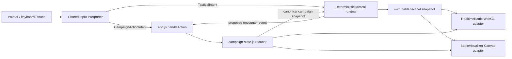

# Architecture Contract — Strategy/Control Depth

**Run:** `20260718-strategy-control-depth`  
**Operating mode:** Stage 2 balance-cycle entering Stage 3 responsiveness/performance  
**Status:** discovery recommendation; no production or test code changed  
**Evidence date:** 2026-07-19

## Decision

Keep `campaign-state.js` as the only campaign reducer. Add one pure, deterministic tactical runtime between that reducer and both renderers. Move map dimensions, cells, anchors, lanes, and route queries into one stage-navigation specification. WebGL and Canvas must consume the same tactical snapshot and the same normalized control intents; they may render differently, but they must never independently decide campaign actions, wave completion, breach eligibility, spawn validity, or route legality.



The tactical runtime is not a second campaign reducer. It owns ephemeral spatial state only: positions, velocity, selected units, paths, local contact, presentation timers, and the one-shot proposal of `breach`/`wave-cleared`. `app.js` still submits those proposals to `applyEncounterEvent`; only an accepted reducer result changes the campaign.

## Evidence classification

- **Observed** means directly read from the repository at the cited file/line or produced by the named focused command.
- **Measured** means a run emitted a numeric sample. No browser frame-time or interaction-latency baseline was run in this discovery pass.
- **Recommended** values are acceptance budgets or proposed constants, not claims about the current build.

## Observed architecture

| Boundary | Observed implementation | Consequence |
|---|---|---|
| Campaign authority | `handleAction` checks availability, calls `applyAction`/`applyEncounterEvent`, replaces `campaign`, then synchronizes/presents only after acceptance (`app.js:2118-2147`). Encounter proposals are session/source guarded before `applyEncounterEvent` (`app.js:1385-1420`). | The reducer boundary is fundamentally sound and should be preserved. |
| Renderer synchronization | `synchronizeBattleRenderer` calls `applyCampaignState` and then `applyEncounter` (`app.js:1336-1355`), while both renderers' `applyCampaignState` already call `applyEncounter` (`battle-realtime-three.js:1289-1304`; `battle-visualizer.js:955-965`). | Encounter reconciliation is duplicated per app sync. It is currently mostly idempotent, but it is unnecessary work and broadens ordering risk. |
| Runtime projection | Renderer runtime statistics are guarded by renderer instance/session and only projected into labels/datasets (`app.js:1235-1362`). | Runtime telemetry is presentation data, not campaign authority. Keep that one-way boundary. |
| Visual feedback | Accepted actions call `triggerBattleVisual`; the renderer receives a semantic effect or a local non-renderer fallback cue (`app.js:2100-2109`). Focused tests assert no duplicate local cue and no renderer-local topology mutation (`tests/app-command-feedback.test.mjs:344-367`; `tests/battle-visualizer.test.mjs:112-176`; `tests/battle-realtime-three.test.mjs:662-858`). | This is the correct command-feedback contract. |
| Map source | All stages are generated into a fixed `16 × 8` heightfield with global portal/boss/node anchors (`stage-navigation.js:3-10`, `stage-navigation.js:26-108`). | Width, height, anchors, and stage topology cannot scale independently. |
| WebGL spatial conversion | Module constants derive offsets from global dimensions; navigation conversion adds those offsets (`battle-realtime-three.js:30-36`, `battle-realtime-three.js:656-671`). | A per-stage dimension change cannot work without changing module-level math. |
| Canvas spatial conversion | Canvas imports global dimensions, but duplicates portal/boss/breach/goal/picket constants and derives node positions separately (`battle-visualizer.js:27-39`, `battle-visualizer.js:318-330`). | Spatial rules already have two sources of truth. |
| Renderer simulations | Both renderers maintain their own allies, enemies, engagements, exchanges, travel, collision, and one-shot encounter proposal state (`battle-realtime-three.js:332-399`; `battle-visualizer.js:148-215`). | Renderer choice changes tactical behavior, not only presentation. |
| Campaign inventory | Rules version is `abyssal-surge-rules-v6` (`campaign-state.js:1`); the `STAGES` array begins at line 31 and Stage 10 is Gate Zenith (`campaign-state.js:31`, `campaign-state.js:464-471`). | Spatial cutover must keep v6 replay/save determinism and all 10 stages valid. |

## Source-grounded defect and risk register

Severity is impact if larger maps and unified controls ship without the proposed boundary.

| ID | Severity | Defect/risk | Exact evidence | Smallest corrective slice | Focused verification |
|---|---:|---|---|---|---|
| ARC-01 | S1 | Canvas can stall an all-breached wave. WebGL clears when every enemy is defeated **or breach-retired**, while Canvas requires every enemy to be defeated. | `battle-realtime-three.js:1124-1130`; `battle-visualizer.js:1350-1362`. WebGL has a mixed defeated/breached regression test at `tests/battle-realtime-three.test.mjs:467-512`; Canvas has no equivalent. | Move resolved-wave predicate into shared tactical runtime: `resolved = defeated || breached`; emit once while pending. | Same wave seed in both adapters: one defeated + one breached emits exactly one `wave-cleared`; one live unit emits none. |
| ARC-02 | S1 | WebGL and Canvas independently generate reducer-facing `breach` and `wave-cleared` proposals from different speeds, routes, collisions, and completion predicates. Fallback mode can therefore change campaign outcomes/timing. | Proposal paths: `battle-realtime-three.js:1079-1130`, `battle-realtime-three.js:1432-1445`; `battle-visualizer.js:1298-1362`, `battle-visualizer.js:1045-1058`. | Introduce one `TacticalRuntime.step(dt, intents, campaignSnapshot)`; adapters consume its immutable snapshot and never emit encounter events directly. | Run identical seed/intents/ticks through WebGL adapter, Canvas adapter, and headless runtime; event transcript and canonical snapshots must match byte-for-byte. |
| ARC-03 | S1 | `A`/`D` have conflicting meanings. WebGL listens for WASD on the focused canvas, while the bubbling window handler maps `a → assault`, `d → domain`; only Domain is specially suppressed when the 3D canvas owns focus. Canvas is not keyboard-focusable in its React declaration. | Movement codes: `battle-realtime-three.js:28-29`, `battle-realtime-three.js:1194-1205`. Action keys and special case: `app.js:30`, `app.js:2488-2500`. Canvas declarations: `react-game-ui.js:414-425`. | One input interpreter with explicit context. Make both canvases focusable; reserve WASD/arrow/Shift for tactical movement when battlefield-focused; expose campaign actions through one non-conflicting binding set (recommended `Digit1`–`Digit7`) and command buttons. | For both renderers, press every bound key with body, canvas, button, and modal focus. Exactly one intent is produced; `A`/`D` never also dispatch a campaign action while moving. |
| ARC-04 | S2 | The stage model is globally fixed to `16 × 8` and one portal/boss/node anchor. | `stage-navigation.js:3-10`, `stage-navigation.js:27-33`, `stage-navigation.js:111-130`. | Replace globals with per-stage immutable `StageNavigationSpec`; keep compatibility accessors only during one atomic migration, then remove them. | Validate 10 existing stages plus a `40 × 24` fixture; bounds, anchors, and routes resolve without renderer constants. |
| ARC-05 | S2 | Stage objectives require 2–3 nodes in stages 2, 6–10, but WebGL creates one capture marker; Canvas invents sequential node positions from `nodeGoal`. | Node goals: `campaign-state.js:88-89`, `campaign-state.js:266-267`, `campaign-state.js:317-318`, `campaign-state.js:368-369`, `campaign-state.js:419-420`, `campaign-state.js:470-471`. WebGL marker: `battle-realtime-three.js:573-576`. Canvas formula: `battle-visualizer.js:318-330`, `battle-visualizer.js:886-893`. | Author explicit `anchors.nodes[]` in the navigation spec; derive campaign `nodeGoal` from the array length or enforce equality in a startup validator. | Every stage exposes exactly `nodeGoal` unique, walkable node anchors; both adapters hit-test the same next uncaptured node id. |
| ARC-06 | S2 | Canvas duplicates portal, boss, breach, goal, and hold-line constants rather than consuming shared navigation anchors/zones. | `battle-visualizer.js:27-39`; action mapping at `battle-visualizer.js:886-893`. | Move all anchors and zones into navigation spec and pass semantic anchor ids, never raw renderer constants. | Snapshot target coordinates for all 10 stages; WebGL and Canvas map each semantic id to the same grid coordinate. |
| ARC-07 | S2 | WebGL click-to-move is a straight target vector checked by sampled collision; it cancels when blocked and has no global route. Enemy routing is direct-to-portal with a local perpendicular nudge. | `battle-realtime-three.js:927-958`, `battle-realtime-three.js:1005-1039`, `battle-realtime-three.js:1079-1106`, `battle-realtime-three.js:1244-1267`. | Shared global static route query plus local collision resolution. Store a waypoint queue on the tactical actor, not the renderer. | Commander and enemy reach goals through Stage 7 bridge openings and a synthetic three-lane wall map; no waypoint enters void or violates climb. |
| ARC-08 | S2 | Canvas A* is only used for selected ally orders. Default ally intercept/picket and all enemies steer without checking heightfield walkability/climb, so visual actors can cross chasms or cliffs. Spawns are random near hard-coded anchors without route validation. | A* order: `battle-visualizer.js:867-881`. Spawn: `battle-visualizer.js:983-1042`. Ungated movement: `battle-visualizer.js:1298-1348`. | Shared tactical runtime owns spawn validation and waypoint paths for every moving actor. Local steering is constrained to a walkable corridor. | Seeded Stage 1/4/7/8/9 runs: zero actor centers or radius probes enter void; all spawned actors have a route to their objective. |
| ARC-09 | S2 | WebGL movement loses elapsed time on slow frames by clamping each frame to 50 ms; Canvas preserves up to 1 s and subdivides into 50 ms steps. Renderer choice and frame rate therefore alter travel time. | `battle-realtime-three.js:731-748`; `battle-visualizer.js:1775-1798`. | One fixed-step accumulator: `h = 1/60 s`, `frameDelta ≤ 0.10 s`, `maxSteps = 6`; render interpolation is adapter-local. | Simulate the same 10 s trace at 30/60/120 Hz plus injected 100 ms stalls; final positions differ by ≤0.02 grid units and event order is identical. |
| ARC-10 | S2 | Camera follow uses constant per-frame `lerp(..., 0.12)` and ignores `dt`, so response changes with refresh rate. | `battle-realtime-three.js:1157-1177`. Static analysis: 95% settle is ~781 ms at 30 Hz, ~391 ms at 60 Hz, and ~195 ms at 120 Hz. | Replace fixed alpha with `α(dt) = 1 - exp(-dt/τ)`; recommended `τ = 0.1304 s` preserves the current 60 Hz feel. | 30/60/120 Hz camera traces reach equivalent target positions within `1e-3` at equal wall time. |
| ARC-11 | S2 | Zoom is an immediate wheel-delta mutation with fixed `[9,30]` bounds; it ignores `deltaMode` and map bounds. Large maps can be clipped or wheel-device dependent. | Defaults/bounds: `battle-realtime-three.js:384-386`, `battle-realtime-three.js:1238-1242`. Perspective camera: `battle-realtime-three.js:443`. | Normalize wheel delta to pixels; store `targetZoom`; derive fit zoom from navigation bounds with authored overrides. Smooth with frame-independent exponential response. | Pixel/line/page wheel fixtures produce equivalent zoom; fit-to-map contains all authored lane endpoints at 16:9 and 9:16. |
| ARC-12 | S2 | Pointer streams are renderer-specific. WebGL overwrites one pointer record, uses a 3 px Manhattan threshold, and only clears on `pointercancel`; Canvas stores no pointer id, uses independent 6 px axis thresholds, and does not explicitly release capture. Neither handles `lostpointercapture`. | WebGL: `battle-realtime-three.js:1207-1235`. Canvas: `battle-visualizer.js:808-864`. Pointer capture semantics require cleanup on capture loss: [W3C Pointer Events](https://www.w3.org/TR/pointerevents/). | Shared `PointerGesture` state keyed by `pointerId`; listen to `pointercancel` and `lostpointercapture`; one threshold policy by `pointerType`; one-click suppression after drag. | Mouse, pen, single-touch, two-touch interruption, cancel, and lost-capture probes leave no stuck state and dispatch at most one click/action. |
| ARC-13 | S2 | Renderer failure creates a new Canvas simulation and only reapplies campaign state, losing positions, orders, velocity, and pending spatial progression. | Fallback replacement: `app.js:1487-1491`, `app.js:1502-1514`. Each renderer constructs its own arrays/state at `battle-realtime-three.js:332-399` and `battle-visualizer.js:148-215`. | Keep `TacticalRuntime` alive across renderer swaps; destroy/recreate only the adapter. | Force WebGL loss mid-wave; after Canvas attach, actor ids/positions/path progress/event transcript are unchanged. |
| ARC-14 | S3 | App synchronizes encounter state twice because `applyCampaignState` delegates to `applyEncounter` and app calls both. | `app.js:1336-1355`; `battle-realtime-three.js:1289-1304`; `battle-visualizer.js:955-965`. | Define one `applySnapshot({campaign, tactical})` adapter method. | Spy test: one campaign update causes one reconciliation and at most one runtime publication per adapter. |
| ARC-15 | S3 | WebGL world presentation has fixed terrain scale, ground plane, shadow extent, ray distance, and zoom values independent of stage bounds. | `battle-realtime-three.js:42-45`, `battle-realtime-three.js:381-386`, `battle-realtime-three.js:443-485`, `battle-realtime-three.js:560-565`. | Derive ground, picking, camera fit, and light/shadow bounds from navigation bounds; allow art metadata to override mesh scale without changing navigation. | `40 × 24` fixture: all anchors pickable, ground receives rays, shadow bounds cover active tactical bounds, no near/far clipping. |
| ARC-16 | S3 | Canvas particles are growable objects, spliced and added to the dynamic sort queue; WebGL uses a fixed 360-particle pool. Bursty larger battles can create fallback-only allocation/sort pressure. | WebGL capacity: `battle-realtime-three.js:104-110`. Canvas growth/update/queue: `battle-visualizer.js:1131-1144`, `battle-visualizer.js:1365-1379`, `battle-visualizer.js:1474-1479`. | Use a fixed 360-slot ring pool in Canvas or a shared capacity policy; drop/recycle oldest presentation particles. | Burst 1,000 effects: live storage never exceeds 360 and encounter/action events are unchanged. |
| ARC-17 | S3 | Focus-loss coverage is good for held movement keys but does not cover pointer capture loss, mixed focus/action conflicts, or Canvas keyboard parity. | Existing coverage: `tests/battle-realtime-three.test.mjs:296-367`. Missing pointer/timing matches are confirmed by no focused tests for `onPointer*`, `updateCamera`, `moveCommander`, or Canvas frame parity. | Add focused contract tests after the shared input/runtime slice, not renderer-specific duplicates. | See the probe matrix below. |

## Proposed canonical data shape

This is a schema recommendation, not implemented code.

```js
const STAGE_NAVIGATION = Object.freeze({
  version: 2,
  stages: Object.freeze({
    "cinder-span": Object.freeze({
      id: "cinder-span",
      size: Object.freeze({ width: 24, height: 12 }),
      cellSize: 1,
      elevationScale: 0.42,
      // Int8Array semantics: -1 void; 0..N elevation. Serialized as validated rows.
      rows: Object.freeze([
        /* exactly height rows, exactly width signed integer cells per row */
      ]),
      anchors: Object.freeze({
        portal: Object.freeze({ id: "portal", x: 1.5, y: 5.5 }),
        boss: Object.freeze({ id: "boss", x: 22.5, y: 5.5 }),
        extractor: Object.freeze({ id: "extractor", x: 7.5, y: 5.5 }),
        nodes: Object.freeze([
          Object.freeze({ id: "node-a", x: 10.5, y: 2.5, zoneId: "north" }),
          Object.freeze({ id: "node-b", x: 12.5, y: 5.5, zoneId: "center" }),
          Object.freeze({ id: "node-c", x: 10.5, y: 8.5, zoneId: "south" }),
        ]),
        rally: Object.freeze({ id: "rally", x: 3.0, y: 5.5 }),
        allySpawns: Object.freeze([
          Object.freeze({ id: "ally-main", x: 1.5, y: 5.5 }),
        ]),
        hostileSpawns: Object.freeze([
          Object.freeze({ id: "hostile-north", x: 22.0, y: 2.5, laneId: "north" }),
          Object.freeze({ id: "hostile-center", x: 22.0, y: 5.5, laneId: "center" }),
          Object.freeze({ id: "hostile-south", x: 22.0, y: 8.5, laneId: "south" }),
        ]),
      }),
      zones: Object.freeze([
        Object.freeze({ id: "north", kind: "lane", cells: Object.freeze([]) }),
        Object.freeze({ id: "center", kind: "lane", cells: Object.freeze([]) }),
        Object.freeze({ id: "south", kind: "lane", cells: Object.freeze([]) }),
        Object.freeze({ id: "portal-zone", kind: "breach", cells: Object.freeze([]) }),
      ]),
      camera: Object.freeze({
        focusAnchorId: "rally",
        minElevationRad: 0.20,
        maxElevationRad: 1.25,
        followTauSeconds: 0.1304,
        zoomTauSeconds: 0.090,
        fitPadding: 1.10,
      }),
    }),
  }),
});
```

The numbers above demonstrate shape and required fields; they are not approved Stage 1 retuning. Existing stages should first be losslessly represented at `16 × 8`. A later design pass can enlarge each map while satisfying the three-lane/zone gate.

### Navigation API contract

`createStageNavigation(stageId)` returns one frozen object:

```ts
type StageNavigation = {
  id: string;
  width: number;
  height: number;
  cellSize: number;
  cells: Int8Array;
  bounds: { minX: number; minY: number; maxX: number; maxY: number };
  anchors: Readonly<StageAnchors>;
  zones: ReadonlyArray<Zone>;
  heightAt(cellX: number, cellY: number): number;
  elevationAt(worldX: number, worldY: number): number;
  walkable(cellX: number, cellY: number): boolean;
  climbOk(fromX: number, fromY: number, toX: number, toY: number): boolean;
  gridToWorld(point: Point): Point;
  worldToGrid(point: Point): Point;
  nearestWalkable(point: Point, radiusCells: number): Point | null;
  findPath(start: Point, goal: Point): ReadonlyArray<Point> | null;
  flowField(goal: Point): FlowField;
};
```

No renderer may import map width, height, anchor, breach, lane, speed, or path constants directly. It receives this object and a tactical snapshot.

### Validation invariants

1. `rows.length === size.height`; every row length equals `size.width`.
2. All anchors are finite, in bounds, and on walkable cells with radius clearance.
3. `anchors.nodes.length === campaignStage.nodeGoal`; node ids and coordinates are unique.
4. At least three authored lane/zone ids exist per stage, and each material lane has a legal path from an entry/spawn anchor to a defended objective. A label without distinct reachable cells does not satisfy the gate.
5. Every hostile spawn has a route to the breach zone; every ally spawn has a route to rally and each objective.
6. Every route step is cardinal or explicitly declares diagonal cost; every step satisfies `climbOk`.
7. Integer serialized cells and deterministic neighbor ordering make path results replay-stable.
8. Navigation data is frozen after validation; renderers cannot mutate it.

## State and ownership contract

| State | Owner | Persistence | May change campaign? |
|---|---|---|---|
| Resources, integrity, legion count, capacity, nodes captured, boss health, availability, wave state | `campaign-state.js` reducer | Save/replay | Yes; sole authority |
| Actor ids/positions/velocity/paths, selection, contacts, tactical clocks | `TacticalRuntime` | Battle session only; transferable across adapters | No direct mutation; may propose encounter events |
| Camera pose, zoom target, particles, audio nodes, meshes/sprites, hover/drag visuals | Renderer adapter | Renderer lifetime only | Never |
| Normalized pointer/key/touch gesture state and action/tactical intents | Input interpreter | Active gesture only | Only by routing a `CampaignActionIntent` through `handleAction` |
| Labels, diagnostics, runtime counters | `app.js` projection | DOM lifetime | Never |

A renderer failure must not recreate `TacticalRuntime`. A campaign snapshot must reconcile actor counts/wave identity in the runtime, then adapters receive one immutable snapshot. Presentation effects may never establish/remove actors; existing tests already defend that rule.

## Control intent contract

```ts
type CampaignActionIntent = {
  kind: "campaign-action";
  action: "hunt" | "extract" | "materialize" | "capture" | "possess" | "domain" | "assault";
  source: "pointer" | "keyboard" | "touch" | "button";
  inputAt: DOMHighResTimeStamp;
};

type TacticalIntent =
  | { kind: "move-vector"; x: number; y: number; surge: boolean }
  | { kind: "move-order"; actorIds: readonly string[]; point: Point }
  | { kind: "select-rect"; rect: Rect }
  | { kind: "camera-orbit"; dx: number; dy: number }
  | { kind: "camera-zoom"; deltaPixels: number }
  | { kind: "cancel-gesture"; pointerId: number };
```

Parity means the same physical intent produces the same normalized intent and, for campaign actions, the same reducer call. It does **not** require identical particle choreography or camera composition.

Recommended binding cutover:

- Battlefield-focused: WASD/arrows move; Shift surges; pointer/touch tap issues the semantic hit or move order; drag is camera orbit in direct mode or selection in command mode.
- Campaign actions: `Digit1`–`Digit7` and the seven native command buttons. Do not overload `A`/`D` while WASD exists.
- Both canvases: `tabIndex=0`, same accessible label behavior, same focus-on-primary-pointer rule.
- Modal/input/button focus: no tactical or campaign hotkey leakage.
- Touch: one active primary pointer; second pointer cancels click eligibility (or enters an explicitly implemented pinch state). No synthetic click after a committed drag.

## Smallest implementation slices

1. **Lock parity defects before scaling.** Add Canvas all-breached completion coverage, key-conflict coverage, pointer cancel/lost-capture coverage, and equal-wall-time camera/movement tests. Fix ARC-01 and input double dispatch without changing map dimensions.
2. **Make navigation data-driven.** Losslessly encode all 10 current `16 × 8` maps and all anchors/nodes/zones in `StageNavigationSpec`. Replace renderer globals and validate `nodeGoal`. No balance numbers change in this slice.
3. **Extract the tactical runtime.** Move actors, fixed-step timing, path requests, contacts, breach/wave proposal logic, and seeded RNG out of both renderers. Keep the current reducer APIs unchanged. Adapt WebGL first while Canvas still reads compatibility snapshots, then cut Canvas over and delete duplicate simulation code in the same release.
4. **Unify controls.** Route both canvases through one pointer/key/touch interpreter; remove renderer listeners that produce divergent intents. Rebind conflicting campaign hotkeys.
5. **Scale one canary map.** Enlarge one stage only after all existing stages pass parity. Require three material lanes/zones, route validation, camera fit, and the budgets in `perf-budget.md`; then apply the schema to the other stages.

## Focused verification matrix

| Probe | Layer | Required assertion |
|---|---|---|
| `node --test tests/battle-realtime-three.test.mjs` | Existing WebGL unit contract | Focus loss, navigation/collision, lifecycle, action-state boundaries remain green. |
| `node --test tests/battle-visualizer.test.mjs` | Existing Canvas unit contract | Semantic hit priority and presentation-only feedback remain green. |
| `node --test tests/app-command-feedback.test.mjs` | Existing app contract | Accepted command gets one feedback owner; no duplicate cue. |
| Headless tactical transcript test | New shared runtime | 30/60/120 Hz and renderer adapter choice yield identical encounter proposal transcript. |
| Stage schema validator test | Navigation | 10 current stages + one large fixture satisfy dimensions, anchors, node counts, three lanes, and reachability. |
| Pointer matrix test | Input | Mouse/pen/touch tap, drag, cancel, lost capture, multi-pointer interruption produce one or zero intended actions and always clear state. |
| Keyboard focus matrix | Input/app | Body, both canvases, command button, import control, briefing, result modal; no `A`/`D` double dispatch or modal leakage. |
| Browser WebGL-loss probe | App/adapters | Mid-wave switch retains tactical actor ids/positions/path progress and does not duplicate breach/wave events. |
| Browser action-to-paint probe | End-to-end | Pointer, keyboard, touch, and button samples all meet the same p95 ≤100 ms feedback contract. |

## External primary references

- [W3C Pointer Events](https://www.w3.org/TR/pointerevents/) — pointer capture, `pointercancel`, and `lostpointercapture` lifecycle.
- [W3C Event Timing](https://www.w3.org/TR/event-timing/) — input delay/processing/presentation timing fields for interaction probes.
- [web.dev RAIL](https://web.dev/articles/rail) — user input should produce a response within 100 ms; the project adopts that as its stricter p95 contract.
- [web.dev Rendering Performance](https://web.dev/articles/rendering-performance) — 60 Hz frame budget and browser work constraints.

## Non-goals for this discovery

- No production/test edits, stage retuning, asset changes, save-schema changes, or renderer replacement were performed.
- The architecture does not make renderer-local particles/audio deterministic; only tactical state and reducer-facing proposals require parity.
- The proposed large-map example is a schema illustration, not approved content or a measured balance improvement.
