# Current Core Loop Map — 2026-07-26

run-id: `20260726-stage1b-cinder-pressure-agency`  
owner: game-programmer systems analysis  
scope: current runtime and tests only; no production/test edits  
labels: **OBSERVED** = directly established in source or an executed test; **INFERENCE** = consequence inferred from those facts; **TARGET** = proposed next slice, not current behavior.

## Executive finding

**OBSERVED:** The shipped loop is a deterministic 60 Hz defense-survivor simulation wrapped by a browser-owned campaign and a snapshot-only renderer. The player moves the Warden, cycles a three-state defense/offense formation stance, casts learned active skills, selects paused in-run growth offers, explicitly commits an elite extraction after a spatial Bind hold, and selects one permanent victory reward. Auto-attacks, authored seeded waves, companion attacks, drops, objective pressure, boss resolution, and campaign unlock/currency derivation run without direct attack buttons.

**OBSERVED:** The strongest current agency gap is not a missing rules system. The lobby exposes persistent per-companion `FRONT/BACK` buttons and saves them, but `createDefenseRun(... formation)` deliberately ignores that map; live slots are derived only from sorted companion ID rank plus the current stance. The pause overlay repeats the saved campaign labels rather than the live snapshot slots. This is reachable UI with a dead combat effect.

**INFERENCE:** The smallest honest agency slice is therefore to make the existing formation choice determine deterministic companion position-rank at run creation, while leaving all stance counts, cooldowns, damage, integrity, wave, extraction, and reward numbers unchanged. This turns an already-shipped input into a real choice and creates a clean paired-measurement seam before any balance retune.

## State flow

```mermaid
stateDiagram-v2
    [*] --> Initialize: storage.open / settleIdleReturn
    Initialize --> Lobby: restored or new campaign

    state Lobby {
        [*] --> Sortie
        Sortie --> PermanentGrowth: stats / skill tree / traits
        Sortie --> Loadout: owned companions / equipment
        Sortie --> SavedFormation: FRONT/BACK campaign map
        PermanentGrowth --> Sortie
        Loadout --> Sortie
        SavedFormation --> Sortie
    }

    Lobby --> RunCreated: startRun + persist attempt + createDefenseRun(seed, loadout, rewards, RPG)
    RunCreated --> GateDefense: STAGE_STARTED / plan committed / VANGUARD
    GateDefense --> GateDefense: seeded waves + auto-fire + MOVE / SKILL_CAST / STANCE_CYCLE
    GateDefense --> EchoRecovery: waves clear, elite spawns and dies
    EchoRecovery --> GrowthChoice: XP threshold + Gate/Echo prerequisites
    GrowthChoice --> GrowthChoice: simulation paused until offered skill selected
    GrowthChoice --> Occupation: SKILL_SELECTED
    Occupation --> ExtractionHold: uncontested occupation hold opens timed Bind window
    ExtractionHold --> ExtractionReady: uncontested extraction hold completes
    ExtractionReady --> BossKill: explicit EXTRACT_ELITE accepted; companion added
    BossKill --> Victory: boss dead
    BossKill --> FinalCompletion: final-stage boss dead

    GateDefense --> Defeat: gate or commander integrity reaches zero
    EchoRecovery --> Defeat: gate or commander integrity reaches zero
    Occupation --> Defeat: gate or commander integrity reaches zero
    ExtractionHold --> Defeat: extraction window expires or integrity reaches zero
    BossKill --> Defeat: gate or commander integrity reaches zero

    Victory --> RewardChoice: authored reward offer
    FinalCompletion --> RewardChoice: authored reward offer
    RewardChoice --> CampaignCommit: REWARD_SELECTED then applyCampaignRunResult
    Defeat --> CampaignCommit: applyCampaignRunResult, no reward/unlock
    CampaignCommit --> Retry: defeat result action
    CampaignCommit --> NextStage: victory result action
    CampaignCommit --> Lobby: lobby/result action
    Retry --> RunCreated
    NextStage --> RunCreated

    state RenderBoundary {
        Snapshot: getRunSnapshot (detached + frozen)
        Projection: app projection + frame-only camera/events
        Renderer: RealtimeBattle or Canvas2D fallback
        Snapshot --> Projection
        Projection --> Renderer
    }
```



The `RenderBoundary` observes every run state but has no transition back into the simulation.

## Runtime ownership and exact flow anchors

| Surface | Current behavior | Reachability | Exact source anchors | Exact test anchors |
|---|---|---|---|---|
| Campaign load / lobby | **OBSERVED:** `initialize()` opens storage, settles idle return, restores or creates the campaign, selects the highest unlocked stage, then renders the lobby. Lobby tabs expose sortie, Warden growth, companions, equipment, stronghold, import/export, reset, and start. | Reachable | `app.js:586-792`, `app.js:2042-2058`; `defense-storage.js:73-190,231-240` | `tests/defense-campaign-adapter.test.mjs:70-90`; `tests/defense-survivor-browser.cjs:88-106` |
| Run entry | **OBSERVED:** Start increments `attemptsByStage` and saves before battle. `BattleSession` derives a stable stage seed and passes loadout, permanent rewards, Warden progression, equipment, and the campaign formation map into `createDefenseRun`. | Reachable | `campaign-state.js:186-193`; `app.js:802-857` | `tests/defense-campaign-adapter.test.mjs:24-34` |
| Deterministic plan / waves | **OBSERVED:** Stage map, wave, and M4 plans are frozen before tick 1. Seeded xorshift draws select wave composition/timing/direction/lane/policy; the resulting schedule and identity are stored in the run. Tick spawns every due schedule entry in stable order. | Automatic after start | `defense-run-simulation.js:28,79-159,1699-1764,1896-1911`; due-wave execution `defense-run-simulation.js:1516-1543` | `tests/defense-run-simulation.test.mjs:165-221`; `tests/g2-measurement-fixture.test.mjs:64-82` |
| Movement input | **OBSERVED:** D-pad pointer controls and keyboard arrows/WASD call `send("MOVE")`; `queueInput` admits the command for the next sim tick. Releasing, blur, or hidden state sends/retains `IDLE`. Movement updates only in `tick`. | Reachable | `app.js:824-830,1102-1169`; `defense-run-simulation.js:860-869,1465-1499,1914-1921` | `tests/defense-run-simulation.test.mjs:212-230`; live controls and keyboard: `tests/defense-survivor-browser.cjs:107-185` |
| Camera | **OBSERVED:** Canvas drag is orbit, pinch is zoom, and neither queues movement. App follow camera is bounded/eased; Three.js owns session-local yaw/pitch/zoom and clamps pitch/zoom. Camera state resets on session disposal and is absent from the run digest. | Reachable, presentation-only | `app.js:49-54,983-1074`; renderer state/methods `battle-realtime-three.js:822-833,1307-1330`; render call `app.js:1385-1399` | `tests/defense-renderer-contract.test.mjs:554-585`; `tests/world-presentation-contract.test.mjs:424-452`; browser decoupling `tests/defense-survivor-browser.cjs:172-185` |
| Defense/offense stance | **OBSERVED:** `STANCE_CYCLE` rotates `VANGUARD → TURRET → SPLIT → VANGUARD` with a 4-second cooldown. Stance config determines offsets and the live derived FRONT count. FRONT companions can absorb attacks; a BACK companion gains the retained back-row bonus while a living FRONT exists. The player can cycle throughout the run. | Reachable | config `rpg-catalog.js:97-171`; input `defense-run-simulation.js:185-230,870-881`; live slots/fire `defense-run-simulation.js:1616-1639`; UI `app.js:1747-1804` | `tests/defense-run-simulation-rpg.test.mjs:183-302,329-385`; catalog invariants `tests/rpg-catalog.test.mjs:117-148` |
| Offense execution | **OBSERVED:** Commander and companions auto-acquire ordered targets and auto-fire. Direct combat input is active-skill casting, not a basic-attack button. Skill damage, criticals, cooldowns, and causal IDs are simulation-owned. | Auto-fire + reachable skill buttons after learning | `defense-run-simulation.js:513-582,671-777,1604-1639`; active-skill UI `app.js:1667-1681` | `tests/defense-run-simulation.test.mjs:530-767` |
| Growth offer | **OBSERVED:** Echo XP is banked, but the first offer is gated behind completed Gate defense and Echo recovery. `makeOffer` deterministically chooses up to three unowned skills. `advanceDefenseRun` stops while an offer exists; selection debits the correct XP threshold, applies the skill, and resumes into occupation. | Reachable; blocking/paused choice | `defense-run-simulation.js:596-669,1241-1274,1685-1692,1923-1955`; UI `app.js:1711-1745` | `tests/defense-run-simulation.test.mjs:233-298`; prerequisite/order test `tests/defense-expansion-contract.test.mjs:214-275`; browser selection `tests/defense-survivor-browser.cjs:186-225` |
| Items | **OBSERVED:** Dead enemies drop Echo; elite death also drops the stage item. Proximity collection auto-applies item effects, records `itemIds`, and emits `ITEM_COLLECTED`. Items are run-scoped and distinct from skills/rewards. | Automatic pickup within range | `defense-run-simulation.js:584-631,950-1003` | `tests/defense-run-simulation.test.mjs:835-886`; layer separation `tests/defense-expansion-contract.test.mjs:498-518` |
| Permanent Warden RPG | **OBSERVED:** Echo Core buys stats/skill-tree nodes; cleared-stage sequences unlock deterministic 3-of-8 trait offers. Bound Fragments buy 3-slot equipment tiers for Warden/owned companions. Derived values are injected at run creation; no investment preserves the legacy baseline. | Reachable in lobby, gated by earned currency/clears | catalog `rpg-catalog.js:27-84,173-200,214-342`; campaign mutations `campaign-state.js:55-88,291-341`; lobby UI `app.js:424-483,517-571`; injection `defense-run-simulation.js:1862-1895` | `tests/campaign-state-rpg.test.mjs:96-200,234-247`; `tests/defense-run-simulation-rpg.test.mjs:108-181`; `tests/rpg-catalog.test.mjs:36-84,171-271` |
| Companions | **OBSERVED:** Up to three owned prototypes form the pre-run loadout; permanent equipment/roles derive their runtime damage/range/integrity. Live stance rank sets FRONT/BACK; FRONT can transition `ACTIVE → DOWNED` once and stops firing. Accepted elite extraction can add its prototype during the run if not already present. | Loadout and combat effects reachable | campaign collection/loadout `campaign-state.js:251-274`; runtime creation `defense-run-simulation.js:224-289,1880-1894`; downing `defense-run-simulation.js:1565-1572` | `tests/defense-campaign-adapter.test.mjs:53-68`; `tests/defense-run-simulation-rpg.test.mjs:75-106,183-248` |
| Elite / extraction | **OBSERVED:** After Gate defense, an elite and escort spawn. Elite death creates a candidate and completes Echo recovery. Growth unlocks occupation; uncontested occupation opens a timed extraction window; an uncontested fixed hold sets readiness. Readiness alone does not extract. The explicit matching `EXTRACT_ELITE` commits once, adds the companion, completes the objective, then allows boss spawn. Window expiry is terminal defeat. | Reachable and explicitly player-committed | candidate `defense-run-simulation.js:950-1003`; occupation/hold/window `defense-run-simulation.js:1337-1455`; explicit input `defense-run-simulation.js:910-939`; boss gate/defeat `defense-run-simulation.js:1647-1662`; UI `app.js:1551-1596,1767-1804` | `tests/defense-run-simulation.test.mjs:299-466`; `tests/defense-expansion-contract.test.mjs:195-212,277-360` |
| Elite campaign handoff | **OBSERVED:** App observes `ELITE_EXTRACTED`, deduplicates by elite ID, immediately calls `captureElite`, and persists. This write occurs before terminal resolution; therefore an accepted extraction is not conditional on subsequent victory in the browser owner. **OBSERVED (gap):** current source tests validate capture/persistence primitives, but the targeted suites do not directly exercise browser defeat-after-acceptance persistence. | Reachable; browser-owned side effect | `app.js:1250-1257`; `campaign-state.js:251-265`; save queue `app.js:407-416` | primitive coverage `tests/defense-campaign-adapter.test.mjs:53-81`; required scenario is specified but not yet proven in `_workspace/20260726-stage1b-cinder-pressure-agency/engineering/instrumentation-contract.md:63-75` |
| Boss, death, terminal | **OBSERVED:** Gate integrity zero, commander integrity zero, or failed extraction sets `DEFEAT`. Boss death sets `VICTORY` or final-stage `FINAL_COMPLETION`, completes boss objective, and opens a reward offer. Companion downing is not terminal and has no same-run revive path. | Reachable outcomes | `defense-run-simulation.js:1647-1682`; companion downing `defense-run-simulation.js:1565-1572`; terminal UI `app.js:1930-1995` | defeat/extraction finality `tests/defense-run-simulation.test.mjs:412-466`; victory/final completion/reward `tests/defense-run-simulation.test.mjs:468-528`; downing `tests/defense-run-simulation-rpg.test.mjs:202-232` |
| Reward / return | **OBSERVED:** Victory blocks campaign resolution on one authored reward choice; defeat skips reward. Campaign result records resolved stage, unlocks the successor once, records achievement/reward, and flags final completion. Result controls retry the same stage after defeat, start the next unlocked stage after victory, or return to lobby. | Reachable | reward application `defense-run-simulation.js:780-786,1956-1960`; result UI `app.js:1930-1995`; campaign commit `campaign-state.js:194-215` | `tests/defense-run-simulation.test.mjs:508-528`; `tests/defense-campaign-adapter.test.mjs:24-51,113-152` |
| Persistent save / idle return | **OBSERVED:** Serialized campaigns are validated and hash-wrapped, with IndexedDB → localStorage → memory fallback. At startup, idle return settles from explicit wall-clock `now`, resolved-stage count, and derived ward level; this is campaign progression, not part of the seeded run digest. | Reachable | `campaign-state.js:128-174,217-250,343-352`; `defense-storage.js:73-190,231-273` | `tests/campaign-state-rpg.test.mjs:249-297,299-463`; `tests/defense-campaign-adapter.test.mjs:70-110` |
| Renderer snapshot boundary | **OBSERVED:** `getRunSnapshot` clone-freezes the public state. App adds stage presentation and normalized coordinates, then passes the projection plus transient frame camera to `renderSnapshot`. Three.js is primary; any mount/render failure falls back to Canvas2D. Renderers reconcile actors/VFX/camera but own no RAF, input listener, campaign import, or outcome transition. | Automatic observer | snapshot `defense-run-simulation.js:1964-2029`; projection/fallback `app.js:1213-1248,1328-1399`; renderer contract `battle-realtime-three.js:793-923,1658-1679` | `tests/defense-renderer-contract.test.mjs:196-275,667-676`; `tests/world-presentation-contract.test.mjs:276-340` |

## Reachable, inert, and unreachable classifications

| Classification | Surface | Evidence and consequence |
|---|---|---|
| **OBSERVED — reachable and mechanically live** | MOVE, STANCE_CYCLE, learned SKILL_CAST, growth SKILL_SELECTED, EXTRACT_ELITE, terminal REWARD_SELECTED | These are the only player-facing simulation sends in `app.js:1102-1169,1679-1681,1732-1740,1791-1803,1946-1952`; each has a matching `processInput` branch in `defense-run-simulation.js:860-947`. |
| **OBSERVED — reachable, app-local** | Pause, camera orbit/pinch, cutscene dismissal, lobby RPG/loadout/equipment controls | Pause gates app advancement at `app.js:1193-1203`; camera and cutscene never enter `queueInput`; lobby mutations update campaign before the next run. They are real UX controls but not simulation commands. |
| **OBSERVED — reachable UI, dead combat effect** | Lobby per-companion `FRONT/BACK` formation | UI reads/writes `campaign.companionFormation` at `app.js:501-515,738-747` and passes it at `app.js:848-857`. Runtime explicitly accepts but ignores `formation`; it sorts only IDs at `defense-run-simulation.js:224-230,1695-1699`. The regression test requires that the map cannot override slots at `tests/defense-run-simulation-rpg.test.mjs:87-96`. |
| **OBSERVED — reachable but misleading during a run** | Pause-overlay companion formation | The pause overlay passes live `downedIds` but `formationRowMarkup` still displays saved campaign `FRONT/BACK`, not `snapshot.companions[*].slot`: `app.js:501-514,1846-1861`. **INFERENCE:** after stance cycling, the overlay can show a campaign label that disagrees with the live stance-derived slot. |
| **OBSERVED — stale instruction** | Lobby briefing says drag the battlefield to move | Copy says “손가락을 끌어 이동” at `app.js:637`; actual canvas drag exclusively orbits and movement is D-pad/keyboard at `app.js:49-54,1030-1074`. The live browser test proves taps do not queue movement at `tests/defense-survivor-browser.cjs:172-185`. |
| **OBSERVED — simulation/test-only, no shipped player UI** | `M4_CARD_DECISION` committed-card select/decline | Plans and two cards exist at `defense-catalog.js:659-692`; simulation processes them at `defense-run-simulation.js:794-858,894-896`; deterministic tests drive them at `tests/g2-measurement-fixture.test.mjs:35-153`. No `app.js` call sends `M4_CARD_DECISION`; the shipped player cannot choose these cards. |
| **OBSERVED — QA probe, not player mechanic** | `M3_TARGET_PROBE` | Accepted by `defense-run-simulation.js:897-909,1914-1920` and exercised at `tests/g2-measurement-fixture.test.mjs:156-168`; there is no app send/control. Keep it classified as instrumentation, not missing gameplay UI. |
| **OBSERVED — reachable notification, zero current benefit** | Boss Rally toast | `BOSS_RALLY_COOLDOWN_REDUCTION = 0` at `rpg-catalog.js:107-108`; the app still displays the sim event and a `0%` reduction toast at `app.js:1354-1365`. This is not unreachable, but its current numeric effect is inert by signed balance policy. |

## Determinism and side-effect boundary

### Inside the deterministic run

**OBSERVED:** The authoritative replay tuple is:

```text
(stageId, unsigned seed, committed stage plan, companion loadout/order,
 permanent reward IDs, Warden progress/equipment, companion equipment,
 ordered queued inputs at next-tick admission)
    -> exact frozen 60 Hz run states and getRunDigest()
```

- State-changing APIs clone and freeze (`defense-run-simulation.js:1-28,1914-1962`).
- Xorshift RNG streams and immutable plan identity are committed at creation (`defense-run-simulation.js:1699-1764`).
- Inputs receive stable input IDs and execute FIFO on the next tick (`defense-run-simulation.js:1460-1463,1914-1920`).
- The public boundary is a detached frozen snapshot, and the digest is exactly its JSON (`defense-run-simulation.js:1964-2029`).
- Equal seed + inputs pass in base and full-RPG cases (`tests/defense-run-simulation.test.mjs:212-221`; `tests/defense-run-simulation-rpg.test.mjs:304-324`).

### Outside the deterministic run

**OBSERVED:** The following must never become simulation authority:

- `requestAnimationFrame`, catch-up accumulator, wall-clock pause, audio, cutscene timers, toast timers, and telemetry live in `BattleSession` (`app.js:1171-1210,1260-1302,1888-1928`).
- App can aggregate events from several sim ticks into one rendered frame; this replaces only the local snapshot view for presentation consumers, not `this.run` (`app.js:1177-1204,1328-1353`).
- Stage projection, camera follow, orbit/pinch, GLB loading, actor smoothing/facing, animation mixers, VFX, and WebGL fallback are renderer/app state (`app.js:1213-1248,1385-1399`; `battle-realtime-three.js:1508-1675`). Renderer observation is proven non-mutating at `tests/world-presentation-contract.test.mjs:276-340`.
- Campaign capture and run resolution are browser-owned writes after observing accepted simulation events (`app.js:1250-1257,1930-1968`). Save backend choice and idle settlement wall-clock are external state (`defense-storage.js:83-113,231-240`).

**INFERENCE:** A replay digest proves the combat trajectory, not that campaign persistence, browser rendering, or idle-return wall time behaved correctly. Those require separate browser/storage evidence.

## Smallest next vertical slice — make saved formation intent real

### Slice

**TARGET:** Reinterpret the existing persisted `campaign.companionFormation` map as deterministic **position-rank intent** at run creation:

1. Keep the existing campaign schema and buttons; do not add currency, stats, modifiers, or stance values.
2. In `resolveFormation`, order valid loadout members by saved intent (`FRONT` first, then `BACK`), with companion ID as the stable tie-breaker. The resulting ordered list remains capped at three.
3. Continue deriving live FRONT count solely from the active stance (`VANGUARD=2`, `TURRET=1`, `SPLIT=1`) and keep the existing 4-second stance cooldown and all combat formulas unchanged.
4. Make the pause overlay show `snapshot.companions[*].slot/status` for the current stance; label the lobby choice as “전열 우선순위” so two saved FRONT choices under a one-FRONT stance have an honest deterministic rank.
5. Add a non-balance `FORMATION_ORDER_COMMITTED` observation at run creation, or equivalently extend the existing `STAGE_STARTED` payload, with `{orderedCompanionIds, requestedFrontIds, stance}`. Feed it to the existing formation-transition measurement packet; do not retune from one run.
6. Correct the lobby drag-to-move briefing in the same UI slice because it describes an input that no longer exists; this is copy alignment, not extra mechanics.

Why this is the smallest slice:

- **OBSERVED:** UI, persistence schema, validation, and run argument already exist (`app.js:501-515,738-747,848-857`; `campaign-state.js:121-126,276-289`).
- **OBSERVED:** The only severed link is runtime consumption (`defense-run-simulation.js:224-230,1695-1699`).
- **INFERENCE:** Wiring that link creates a real pre-run choice without inventing a fourth stance, changing encounter data, or prematurely tuning current failure rates.

### Measurable acceptance criteria

| ID | **TARGET** acceptance criterion | Required evidence |
|---|---|---|
| F1 | A three-companion save with two requested FRONT members produces those two members at position ranks 0 and 1 under VANGUARD; the remaining member is rank 2/BACK. Under TURRET/SPLIT, rank 0 is the sole FRONT. | New simulation test asserting tick-0 and post-stance snapshot IDs/slots. |
| F2 | Two runs with identical seed, RPG state, formation intent, and input tape have byte-identical `getRunDigest()` at creation, mid-run, and terminal. | Extend the full-RPG determinism case modeled by `tests/defense-run-simulation-rpg.test.mjs:304-324`. |
| F3 | Changing only formation intent changes committed companion order/slot ownership, while catalog values and global stance counts remain unchanged. | Paired snapshot assertion plus a diff proving no edits to `defense-catalog.js` or `rpg-catalog.js`; retain `tests/rpg-catalog.test.mjs:117-148`. |
| F4 | Existing campaign constraints still reject non-loadout IDs and a third requested FRONT member, and save/restore preserves the valid intent. | Retain/extend `tests/campaign-state-rpg.test.mjs:202-232,401-429`. |
| F5 | A browser user can change formation intent, start the run, pause, and see the same live slot ownership in the pause overlay; cycling stance updates the displayed live slots. | One focused browser journey using selectors `[data-warden-formation]`, `#start-defense`, `#stance-cycle`, `#toggle-pause`, and live companion slot markers. |
| F6 | Every run emits exactly one formation-commit observation before any `STANCE_SWITCHED` event; the observation contains stable ordered IDs and requested intent. | Deterministic event-order test and exported `formationTransition` row conforming to `engineering/instrumentation-contract.md:41-61`. |
| F7 | No balance number changes ship in the slice: wave schedule, enemy/commander stats, stance `[2,1,1]`, 4-second cooldown, back-row bonus, extraction radii/holds/windows, rewards, and RPG costs remain byte-identical. | Catalog/config checksum or targeted source diff plus the existing focused suites. |
| F8 | Before any numeric retune, collect paired same-seed trials that vary only formation intent and report damage by companion/phase, downs, gate/commander minimum integrity, terminal outcome, and accepted switch tick. Report `NOT_EXPOSED` when no post-choice pressure exists. | Instrumentation output; synthetic controller explicitly labeled. No G2/G3/G7 claim from this slice alone. |

### Explicit non-goals

**TARGET:** Do not expose M4 cards in this slice: current card selection only changes trace/recovery status and is not yet a demonstrated combat lever. Do not add direct basic attacks, revive, rerolls, a fourth stance, extraction leniency, or new rewards. Do not change any current balance number until the F8 paired evidence shows which formation choices are meaningful under pressure.

## Verification executed for this map

**OBSERVED:** All focused suites passed on 2026-07-26:

| Command | Observed result |
|---|---|
| `node --test tests/defense-run-simulation.test.mjs` | 27 passed, 0 failed |
| `node --test tests/defense-run-simulation-rpg.test.mjs` | 23 passed, 0 failed |
| `node --test tests/defense-campaign-adapter.test.mjs tests/campaign-state-rpg.test.mjs` | 35 passed, 0 failed |
| `node --test tests/defense-renderer-contract.test.mjs tests/world-presentation-contract.test.mjs` | 25 passed, 0 failed |

These checks establish current simulation, RPG, campaign, and renderer contracts. They do not establish live defeat-after-extraction persistence or the proposed formation slice; those remain **TARGET** evidence items F5/F6/F8.
