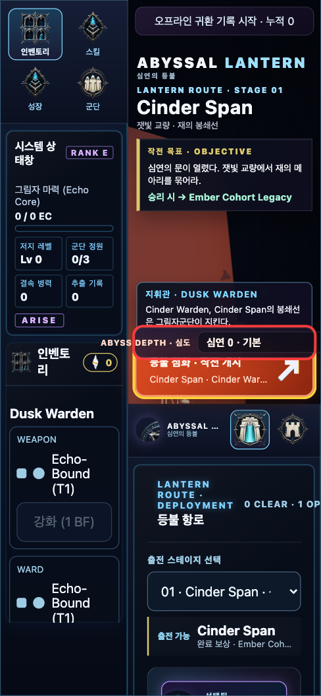

# Abyss Depth — 변경 설명본 (Playwright 캡처)

> 오늘 gap-research 제안(`../production/gap-analysis.md`)을 현재 Abyssal Lantern 빌드에 구현한 **Abyss Depth 난이도 래더**의 실동작 캡처. 커밋 `fc8599cb`. Playwright(헤드리스 Chromium, 390×844 모바일)로 캡처, 빨간 테두리 = 신규 요소.
> 캡처 시점 HEAD: `d8026f5`(main) + 이 기능 커밋. 검증: 유닛 76/76 · CI 브라우저 3/3 · depth-0 identity(getRunDigest 바이트 동일).

## 한 줄 요약
전투개시(sortie) 화면에 **"ABYSS DEPTH · 심도" 셀렉터**를 새로 붙였다. 심도를 올리면 그 판에서 **적 HP/XP +15%/단계**(GAP-A) + **적 정책·구성 로테이션**(GAP-C)이 즉시 적용되고, 전투 HUD에 **`ABYSS DEPTH n` 배지**가 뜬다. 티어는 **스테이지를 클리어할수록 열린다**(clear-to-unlock). 런-스코프라 저장/경제는 무변경.

---

## [1/3] 현재 세이브(0 클리어) — 신규 셀렉터가 바로 보인다


- **빨간 테두리** = 신규 `ABYSS DEPTH · 심도` 셀렉터. 전투개시 버튼(노란 테두리) **바로 위**에 상시 노출.
- 현재값 `심연 0 · 기본`. 드롭다운 옵션(readback):
  - `심연 0 · 기본` (선택 가능)
  - `심연 1 · 잠김 (1 클리어 필요)` … `심연 5 · 잠김 (5 클리어 필요)` — 전부 비활성
- 즉 아무것도 안 깬 상태에서도 **사다리의 존재가 즉시 보이고**, 몇 번 클리어하면 어디까지 열리는지 알 수 있다.

## [2/3] 심도 해금 — Cinder Span 1클리어 후


- (데모용으로 앱 자체 모듈 `createCampaign`/`applyCampaignRunResult`로 "Cinder Span victory" 세이브를 정당하게 시드 → `resolvedIds:["cinder-span"]`.)
- 셀렉터가 `심연 1 · 적 +15%`로 **선택 가능**해졌다(`←선택`). 티어 2–5는 여전히 잠금.
- 사ортие 라벨에 **`· 심연 1`**이 붙는다: `Abyss Chancel · Veil Tactician · 심연 1`.
- 좌측 시스템 상태창도 함께 갱신(저지 레벨 Lv 1 / 그림자 마력 3/3 EC / 1 CLEAR).

## [3/3] 심도 1로 전투개시 — 전투 HUD 배지


- 전투 진입 시 상단 미션 패널(점선)의 지형 컨텍스트 라인이 심도 배지를 물고 온다(readback 확정):
  `서약 고리 · 서약의 압력 · 예배소 서약 → 결속 지점 · **ABYSS DEPTH 1**`
- 전투 시작 순간 **심도 셀렉터는 DOM에서 제거**(`selectorGone: true`) — 사ортие 전용, 런 커밋 후 잠김.
- 이 판의 잡몹은 심도 1 스케일(+15%)로 스폰되고, 심도 시드 fold로 적 구성/정책이 심도 0과 다르게 굴러 나온다.

---

## 화면 밖(코드)에서 함께 바뀐 것 — 결정론 실측
| 항목 | 값 |
|---|---|
| 적 HP 스케일 | depth 0 잡몹 3000 → depth 1 4140 → depth 3 5220 (Node 실측, `+15%/depth`) |
| 구성 로테이션(GAP-C) | 심도가 웨이브 rng 시드에만 fold → 심도마다 다른 적 정책/조합 |
| depth 0 identity | 스냅샷에 `abyssDepth` 키 부재 → 기존 `getRunDigest` 픽스처 바이트 동일 |
| 검증 | 유닛 76/76 · CI 브라우저 3/3(hud/survivor/perf) 통과 |

## 바뀐 파일
- `defense-run-simulation.js` — `ABYSS_DEPTH_MAX`, 심도 스케일(`effScale`), 웨이브시드 fold, 스냅샷 `abyssDepth`(조건부)
- `app.js` — import, `selectedAbyssDepth`/`maxUnlockedAbyssDepth()`, `renderAbyssDepthControl()`, 사ортие 라벨, HUD 배지, `createDefenseRun({abyssDepth})`
- `styles.css` — `.abyss-depth-control` 위치(데스크톱 중앙/모바일 fab 밴드)

## 범위·다음 단계
- **런-스코프**: 심도는 저장 안 됨(리로드 시 0). 저장 스키마·경제 공식 무변경 → CI/결정론 리스크 0.
- **GAP-B(아이들 싱크·Daily Echo)는 이번 제외** — 저장 스키마 v2가 필요해 별도 승인·마이그레이션 건.
- 영구화(선택 심도 저장)·심도별 보상 배수(경제)·Daily는 후속 슬라이스.

## 재현 방법
```
python3 -m http.server 8100 --bind 127.0.0.1   # 저장소 루트에서
# 브라우저에서 http://127.0.0.1:8100/ 열기 (옛 화면이면 Cmd+Shift+R 하드 리로드)
# 전투개시 버튼 위 "ABYSS DEPTH · 심도" 확인 → Cinder Span 1클리어 시 심연 1 해금
```

> 주: 데모의 "1클리어" 세이브는 헤드리스 브라우저 안에만 저장됐다. 실브라우저 세이브는 무손상.
