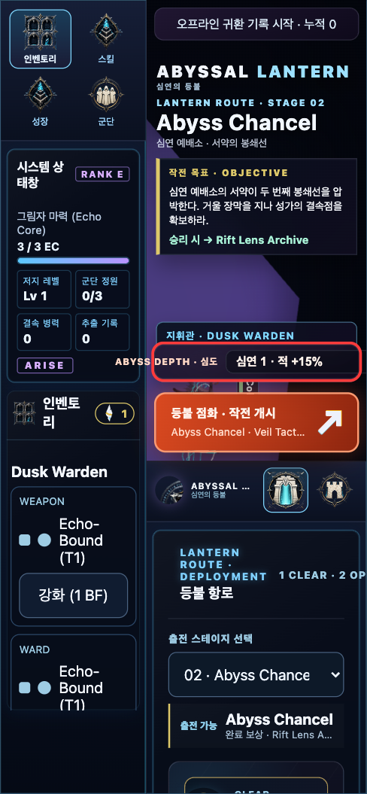
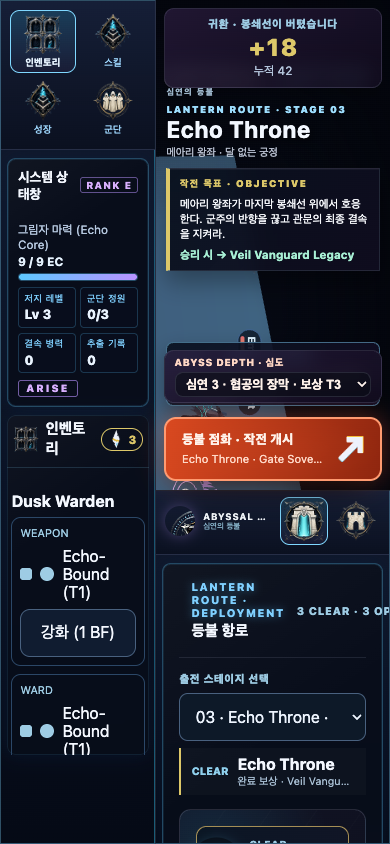
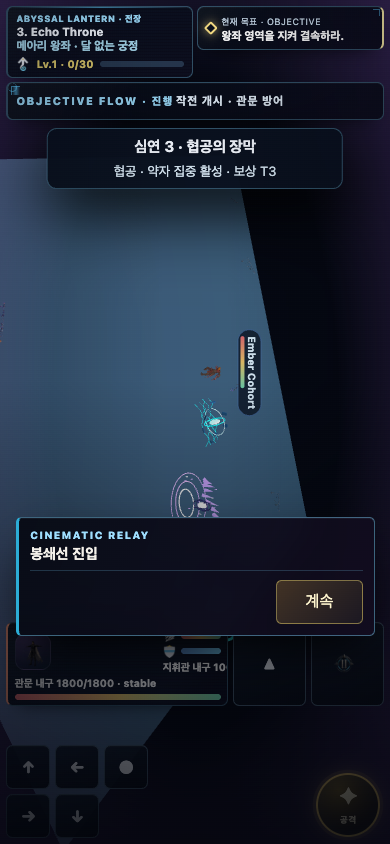
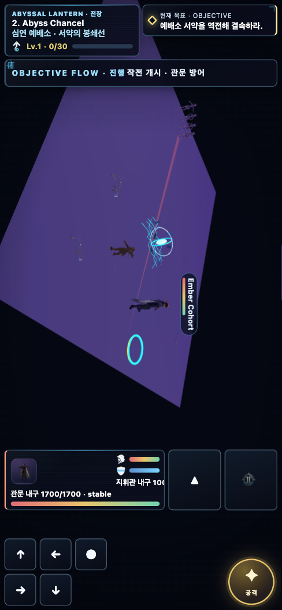
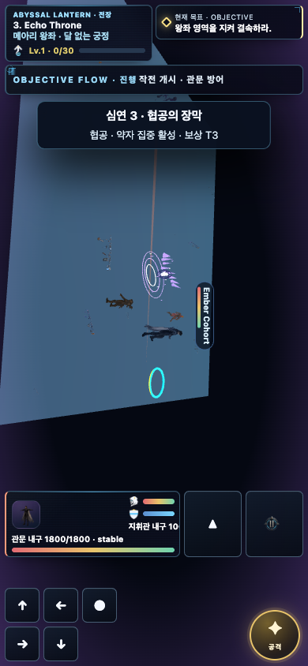

# Abyss Depth v2 — 바뀌기 전 vs 바뀐 후 (기획 설명본)

> 대상: Abyssal Lantern 심연(Abyss Depth) 난이도.
> 커밋: `543194e8`(v2 규칙 패키지) → `938fac99`(UI 겹침 + 캐시 수정).
> 캡처: Playwright 실측(모바일 390×844), 전부 **수정 후 빌드**에서 재촬영.
> 근거: 동일 장르 6게임 게임필 조사(맨 아래 레퍼런스).

## 이번에 보고된 두 문제 — 원인과 조치 (먼저 요약)
1. **"바뀐 내용이 게임에 적용 안 됨"** → 코드·git·디스크는 정상(유닛 52/52·CI 통과)이었고, 원인은 **브라우저에 등록된 옛 서비스워커가 옛 캐시를 계속 서빙**한 것. `sw.js`를 고쳐 **로컬 빌드는 활성화 시 전 캐시를 비우도록**(networkFirst와 결합) 만들어 앞으로 재빌드가 항상 즉시 반영된다. 지금 한 번은 아래 §리셋대로 강제 새로고침이 필요하다.
2. **"UI가 겹침"** → 진짜 버그였다. 모바일에서 심도 셀렉터가 좌측 덱을 침범하고 드롭다운이 화면 밖으로 나갔다(§1). 세로 스택으로 재배치해 해결, 실측으로 넘침 0 확인.

## 왜 v2로 바꿨나 (한 문단)
전에는 심도를 올려도 **"적 체력 +15% + 작은 글자 배지"** 뿐이었다. 플레이어 입장에선 "같은 싸움을 더 오래" 할 뿐, **아무것도 새로 안 생기는** 느낌이었다(스탯 뻥튀기). 조사한 6개 게임은 하나같이 난이도 단계를 **"이름 붙은 규칙 변화 + 눈에 보이는 차이 + 보상"** 으로 만든다. 그래서 심도를 **3개의 이름 붙은 규칙 패키지**로 다시 지었다. 스테이지가 3개라 심도도 3개(재의 추격 / 메아리 기근 / 협공의 장막), 하나 클리어할 때마다 다음 심도가 열린다.

---

## 1. 출전 화면 — 무엇을 고르는가 (+ UI 겹침 수정)

**전(前):** 드롭다운이 `심연 1 · 적 +15%`. 숫자만. 뭐가 달라지는지 알 수 없다.

**후(後):** 드롭다운이 `심연 1 · 재의 추격 · 보상 T1` / `심연 2 · 메아리 기근 · T2` / `심연 3 · 협공의 장막 · T3`. **이름 + 보상 등급**이 바로 보인다. 잠긴 심도도 이름을 미리 보여줘 "여기까지 있구나"가 읽힌다. 출전 버튼에도 `· 심연 3 협공의 장막`이 붙는다.

> **UI 겹침 수정:** 모바일(≤699px)에서 이 셀렉터가 좌우 덱 사이 좁은 띠(약 218px)에 **가로 한 줄**로 놓여, 라벨 `ABYSS DEPTH`가 왼쪽 덱을 파고들고 드롭다운은 오른쪽 화면 밖으로 45px씩 삐져나왔다. → **세로 스택**(라벨 위, full-width 드롭다운 아래)으로 바꿔 전부 화면 안에 들어온다. 실측: 라벨 왼쪽 x=119→175(컨테이너 안), 드롭다운 오른쪽 x=427→371(뷰포트 안), 가장 긴 옵션도 안 잘림. 데스크톱(넓음)은 원래 정상이라 그대로.
> 기획 포인트: 플레이어가 **"무슨 일이 벌어질지 알고" 선택**한다. (참고: Slay the Spire 승천 — 각 단계가 이름 붙은 규칙 하나. Vampire Survivors — 출전 화면에서 토글을 미리 읽음.)

## 2. 전투 진입 순간 — "다른 판이다"라는 신호

**전:** 아무 신호 없음. 그냥 전투가 시작됨.

**후:** 시작하자마자 **배너**가 뜬다 — `심연 3 · 협공의 장막 / 협공 · 약자 집중 활성 · 보상 T3`. 동시에 **화면 전체에 심도 색(보라)이 은은하게 깔린다**(심연 1=주황, 2=한기 파랑, 3=보라). "이건 평소랑 다른 모드"라는 즉각적 인상.

> 기획 포인트: 죽기 전에 **"왜 어려운지"를 먼저 알려준다.** (참고: Hades — 진입 시 조건 명시. Dead Cells — 부패 단계 표시.)

## 3. 전투 중 — 화면과 적이 실제로 다르다

**전:** 상단에 작은 글자 `ABYSS DEPTH 1` 한 줄. 적·화면은 평소와 똑같음.

**후:** 화면에 **심도 색 워시**가 유지되고, HUD에 `심연 3 협공의 장막 · 협공 · 약자 집중`. 그리고 **적이 실제로 다르게 움직인다**(아래 표). 정예(엘리트)는 심도 색 오라를 두르고 호위를 더 데려온다.

> 기획 포인트: 난이도가 **화면·행동으로 체감**된다. (참고: Risk of Rain 2 / Diablo·PoE — 색으로 구분되는 엘리트 어피스 = 새 위협.)

## 4. 적 행동·난이도 — 숫자가 아니라 규칙 (Node 실측)

| 심도 | 이름 | 일반 웨이브 지배 정책(실측) | 회복 상한 | 정예 |
|---|---|---|---|---|
| 0 | (기본) | 혼합(player-pursuit·flank·resource-denial) | 0.25 | 기본 |
| 1 | 재의 추격 | **player-pursuit 3 / gate 2** — 적이 관문 대신 **지휘관을 직격** | 0.25 | 재의 오라 |
| 2 | 메아리 기근 | **resource-denial 3 / flank 2** — echo 차단, **지속력 고갈** | **0.12** (회복 반토막) | 냉기 오라 |
| 3 | 협공의 장막 | **flank 3 / low-hp 2** — 측면·약자 집중 | 0.20 | 보라 오라 + **호위 2기** |

숫자(+15%)는 조용한 밑간으로만 남기고, **플레이어가 대응을 바꿔야 하는 건 "적이 뭘 노리는가"** 로 옮겼다. 같은 빌드가 전 심도를 다 풀지 못한다(심도마다 위협 축이 다름).

## 5. 검증 요약
- **심도 0 = 기존과 완전 동일**(바이트 단위) → 유닛/계약 **52/52 통과**(핵심 스위트), CI 브라우저 계약(반응형·서바이버) **통과**.
- 심도 1/2/3 = 정책 분포·회복 상한이 패키지대로 실제로 달라짐(Node 결정론 측정).
- 결정론(리플레이 재현) 유지, reduced-motion 대응(틴트 비블렌드 폴백), 무수익화(보상은 숙련·시간).
- **UI**: 모바일 심도 셀렉터 넘침 0(좌측 덱·뷰포트·sortie 버튼과 겹침 없음, 실측).

## 6. 참고한 레퍼런스 (동일 장르 6게임, 게임필 조사)
| 게임 | 난이도 시스템 | 우리가 가져온 것 |
|---|---|---|
| Hades | Pact of Punishment / Heat | 심도 = 이름 붙은 규칙 묶음(정책 프리셋) + 진입 시 명시 |
| Slay the Spire | Ascension 1–20 | "한 심도 = 하나의 이름 붙은 규칙", 셀렉터에 리스트로 표시·누적 해금 |
| Dead Cells | Boss Cells + 어피스 | 심도마다 **회복(지속력) 삭감**(D2), 정예 어피스 |
| Risk of Rain 2 | Eclipse + 색코딩 엘리트 | **색으로 다른 엘리트 = 새 콘텐츠**(오라), 단계 해금 |
| Diablo / PoE | 엘리트/레어 어피스 | 정예가 시각적으로 다르고 **보상과 결합** |
| Vampire Survivors | Arcana / Hyper·Inverse | **출전 화면에서 미리 읽는 규칙 토글**, 진입 시 규칙 변경 |

전문: `../research/difficulty-feel/report.md` · 게임별 원자료 `../research/difficulty-feel/results/*.json` · 엔진 매핑 `../research/difficulty-feel/engine-levers-for-feel.md`.

## 7. 실기에서 확인하려면 (리셋 1회)
브라우저에 옛 서비스워커가 남아 있으면 위 변경이 안 보일 수 있다. **한 번만** 아래 중 하나:
- **강력 새로고침**: `Cmd+Shift+R`(맥) / `Ctrl+Shift+R`(윈).
- 안 되면 DevTools(F12) → **Application → Service Workers → Unregister** → **Clear storage → Clear site data** → 새로고침.
이후부터는 `sw.js` 수정으로 재빌드가 자동 반영된다(추가 조치 불필요).

## 8. 남은 것 (후속)
- 정예 오라의 **3D 재색**(현재는 색 틴트 + 호위/정책으로 표현; 렌더러 오라는 다음 단계).
- 심도 영구 저장·**보상 배수의 실제 경제 반영**(현재 표시 T등급; 경제 결합은 스키마 결정 후).
- 심도 4–5 확장(스테이지 확장 시).
