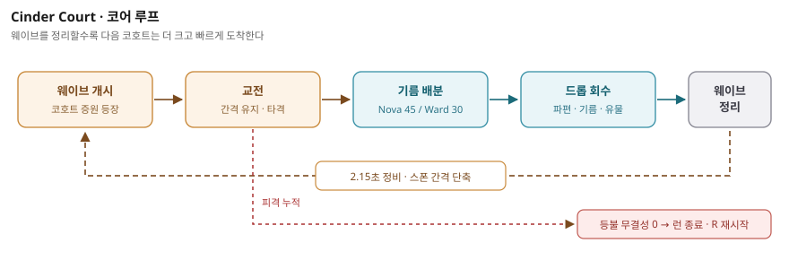
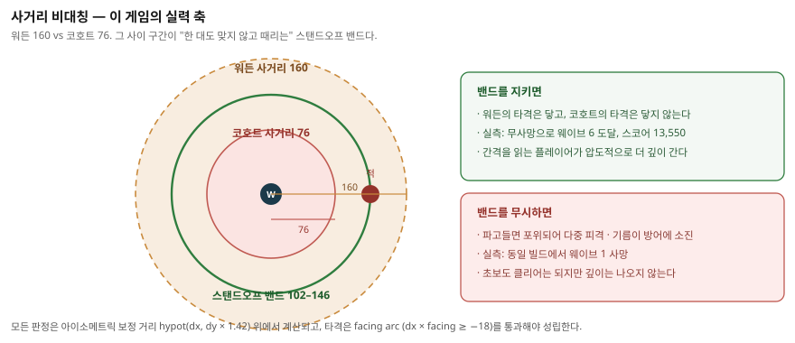

# 1. 게임 제목 및 한 줄 소개

**Abyssal Lantern — Hold the Cinder Court**

> 마지막 등불을 든 Dusk Warden이 되어, 등불의 기름을 태워 Ember Cohort의
> 밀려오는 파도로부터 심연의 재의 법정을 지켜내는 2.5D 아이소메트릭 아레나
> 디펜스.

브라우저 링크 하나로 즉시 실행되는 단일 페이지 웹 게임입니다. 설치, 로그인,
계정, 네트워크 연결이 모두 필요 없습니다.

---

# 2. 게임 방법

## 2.1 목표

Cinder Court(재의 법정)의 중앙에 선 채로, 끝없이 증원되는 Ember Cohort를
격파하며 **웨이브를 최대한 깊게 밀어내는 것**이 목표입니다. 점수는 처치와
유물(Relic mote) 회수로 누적되며, 웨이브를 하나 정리할 때마다 다음 코호트는
더 크고 더 빠르게 도착합니다.

핵심 긴장은 **등불 기름(Lantern oil)의 배분**에 있습니다. 기름은 초당 7씩
자동 회복되고 처치당 6이 추가로 들어오지만, 두 개의 권능이 그 기름을
경쟁적으로 소비합니다. 언제 태우고 언제 아끼는가가 한 판의 실력입니다.



## 2.2 조작

| 입력 | 동작 |
|---|---|
| `W` `A` `S` `D` 또는 방향키 | Dusk Warden 이동 |
| `Space` | 근접 공격 (Strike) |
| `Q` | **Ember Nova** — 반경 안의 모든 적에게 광역 피해 |
| `E` | **Lantern Ward** — 3초간 모든 피해 무효화 |
| `R` | 즉시 재시작 (Rekindle) |
| 화면 방향 패드 / Strike 버튼 | 터치·마우스 조작 (모바일 동등 입력) |
| 스킬 카드 클릭·탭 | Ember Nova / Lantern Ward 발동 |

키보드, 포인터, 터치, 화면 버튼의 **네 경로가 모두 동일한 게임 입력에
도달**합니다. 데스크톱 키보드가 없어도 조작에 손실이 없습니다.

## 2.3 전투 규칙 (실제 구현 수치)

| 항목 | 값 |
|---|---|
| 시뮬레이션 | 고정 스텝 60 Hz (`FIXED_STEP = 1/60`) |
| 아레나 | 1536 × 1024 월드, 중심 (768, 604), 반경 520 × 270 |
| 워든 체력 / 이동속도 | 100 / 218 u·s⁻¹ |
| 워든 공격력 / 사거리 / 쿨다운 | 58 / 160 / 0.48 s |
| 적 체력 / 사거리 / 쿨다운 | 58 / 76 / 1.22 s |
| 동시 등장 상한 | 20 |
| 등불 기름 | 최대 100, 초당 +7, 처치당 +6 |
| Ember Nova | 45 기름, 쿨다운 6.5 s, 반경 250, 피해 96 |
| Lantern Ward | 30 기름, 쿨다운 9 s, 지속 3 s |
| 드롭 | Ember shard(+18 체력) / Oil flask(+35 기름) / Relic mote(+250 점수) |
| 드롭 수명 / 자력 반경 | 12 s / 78 |

**설계 의도 — 사거리 비대칭.** 워든의 사거리(160)는 코호트의 사거리(76)보다
두 배 넘게 깁니다. 무작정 파고들면 포위당해 죽고, 거리를 유지하며 치고 빠지면
한 대도 맞지 않고 정리할 수 있습니다. 초보자도 클리어는 하지만, 간격을 읽는
플레이어가 압도적으로 더 깊이 갑니다.



같은 빌드, 같은 자동 조작에서 밴드 유지 여부만 바꾼 대조 결과입니다.

| 플레이 방식 | 도달 웨이브 | 최종 점수 | 사망 |
|---|---|---|---|
| 밴드 무시 (무작정 접근) | 1 | 300 | 있음 |
| 밴드 유지 (102–146) | 6 | 13,550 | 없음 |

**아이소메트릭 거리 판정.** 모든 전투 판정은 세로축에 1.42배 가중치를 적용한
거리(`hypot(dx, dy × 1.42)`)를 씁니다. 화면에 보이는 비스듬한 원근과 실제
타격 판정이 일치하도록 맞춘 값입니다. 또한 타격은 워든이 바라보는 방향
(`dx × facing ≥ -18`)에서만 성립하므로, 등 뒤의 적은 돌아서야 벨 수 있습니다.

## 2.4 종료 조건

등불 무결성(Lantern integrity)이 **0이 되면 런이 종료**됩니다. 게임 오버 패널이
최종 점수·웨이브·유물·처치 수를 제시하고, `R` 또는 Rekindle 버튼으로 즉시
웨이브 1부터 다시 시작합니다. 9초간 입력이 없으면 심연 기록(Abyss log)
라우트로 자동 이동합니다.

런 결과는 `localStorage`의 `abyssal-lantern:cinder-court:last-run` 키에
다이제스트로 남습니다. 서버 전송은 없습니다.

---

# 3. 실행 방법

## 3.1 플레이 링크 (권장)

<https://jellyggumi.github.io/Abyssal-Lantern/>

브라우저에서 링크를 열면 바로 플레이됩니다. 별도 설치·라이선스·로그인이
필요 없습니다. 최신 Chrome / Edge / Safari / Firefox에서 동작하며, 모바일
브라우저에서는 화면 방향 패드와 Strike 버튼으로 동일하게 조작합니다.

## 3.2 소스에서 직접 실행

```bash
git clone https://github.com/jellyggumi/Abyssal-Lantern.git
cd Abyssal-Lantern
npm ci
python3 -m http.server 4173
# 브라우저에서 http://127.0.0.1:4173/ 열기
```

`file://` 직접 실행은 지원하지 않습니다. ES module과 오프라인 저장 계약이
HTTP 오리진을 요구하기 때문입니다.

## 3.3 검증 실행

```bash
node --test 'tests/**/*.test.mjs'   # 전체 Node 회귀
node tests/sprite-2-5d-browser.cjs  # Cinder Court 브라우저 계약
```

---

# 4. 플레이 영상

30~60초 규격의 실제 플레이 영상입니다.

- **YouTube**: (제출 시 링크 기재)
- **저장소 원본**: `assets/video/nan2026-cinder-court-play.mp4`
  — H.264 1280×720 30 fps, 52.47초, 1,574프레임

영상은 **실제로 구동 중인 게임을 실제 입력으로 플레이한 화면을 그대로 캡처**한
것입니다. 프레임 합성·보간·재생성·타사 영상 사용이 일절 없습니다. 재현
명령과 실측 근거는 AI 활용 기술 문서 6장에 기재했습니다.

영상에 담긴 실측 결과:

| 지표 | 값 |
|---|---|
| 도달 웨이브 | 1 → 6 |
| 최종 점수 | 13,550 |
| 회수 유물 | 5 |
| 종료 시 체력 | 100 / 100 (무사망, 재시작 0회) |
| Ember Nova 사용 | 6회 |
| Lantern Ward 사용 | 4회 |
| 페이지 오류 | 0건 |

---

# 5. 저장소

- **소스**: <https://github.com/jellyggumi/Abyssal-Lantern> (공개)
- 게임 전체 소스와 커밋 기록이 동일 저장소에 포함되어 있습니다.
- 심사 계정 초대가 필요할 경우: `dl_gameai_reviewer@nhn.com`

## 주요 파일

| 경로 | 역할 |
|---|---|
| `index.html` | 게임 진입점, HUD·컨트롤 마크업 |
| `sprite-2-5d.js` | 시뮬레이션, 렌더링, 입력, 오디오 합성 전체 |
| `sprite-2-5d.css` | 아레나·HUD 레이아웃 및 반응형 규칙 |
| `assets/images/sprite-2-5d/` | 배경 플레이트, 스프라이트 시트, 매니페스트 |
| `scripts/capture-cinder-court-play.mjs` | 플레이 영상 캡처 하니스 |
| `tests/sprite-2-5d-browser.cjs` | 브라우저 런타임 계약 검증 |
