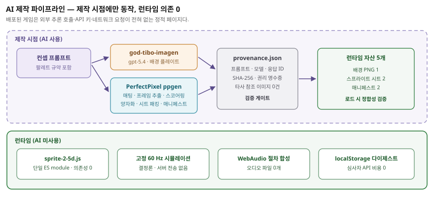
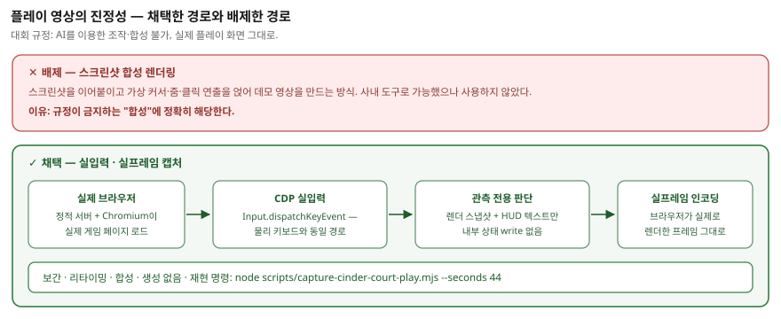

# 0. 요약

이 게임에서 AI는 **보조 도구가 아니라 제작 파이프라인 그 자체**입니다.
배경 플레이트, 캐릭터 스프라이트, 게임 코드, 검증 하니스, 그리고 제출용 플레이
영상 캡처까지 전부 AI 에이전트 워크플로 위에서 만들어졌습니다.

다만 **런타임에는 AI가 한 줄도 실행되지 않습니다.** 배포된 게임은 외부 추론
호출, API 키, 네트워크 요청이 전혀 없는 순수 정적 웹 페이지입니다. AI는
제작 시점에서만 동작하고, 산출물은 결정론적 자산과 코드로 고정됩니다.
심사자가 링크를 열었을 때 유료 API 비용이나 지연이 발생하지 않는 구조입니다.

| 축 | 도구 | 산출물 |
|---|---|---|
| 배경 아트 | god-tibo-imagen (gpt-5.4) | 아이소메트릭 배경 플레이트 1장 |
| 캐릭터 스프라이트 | PerfectPixel `ppgen` | 2캐릭터 × 3상태 시트 + 매니페스트 |
| 게임 코드·검증 | Claude / GJC 에이전트 워크플로 | 시뮬레이션, 렌더러, 테스트, 캡처 하니스 |
| 사운드 | **AI 미사용** — WebAudio 절차 합성 | 오디오 파일 0개 |

---

# 1. 시스템 구조

## 1.1 런타임 구조 (AI 비의존)

| 계층 | 구성 요소 | 성격 |
|---|---|---|
| 진입점 | `index.html` | HUD·컨트롤 마크업 |
| 로직 | `sprite-2-5d.js` | 단일 ES module, 외부 의존성 0 |
| ├ 시뮬레이션 | 고정 60 Hz | 결정론적 전투 규칙 |
| ├ 렌더러 | Canvas2D 페인터 | 깊이 정렬 + 0.62~1.0 스케일 |
| ├ 입력 | 라우터 | 키보드 / 포인터 / 터치 / 버튼 |
| ├ 오디오 | WebAudio 절차 합성 | 오실레이터 엔벨로프 큐, 파일 0개 |
| └ 저장 | localStorage 다이제스트 | 서버 전송 없음 |
| 자산 | `cinder-court-backdrop.png` | 생성 배경 |
| 자산 | `warden/{sprite-sheet.png, manifest.json}` | 생성 스프라이트 |
| 자산 | `ember-cohort/{sprite-sheet.png, manifest.json}` | 생성 스프라이트 |

런타임이 로드하는 자산은 **정확히 5개**(배경 1 + 시트 2 + 매니페스트 2)입니다.
매니페스트는 로드 시점에 시트 크기·셀 격자·프레임 사각형이 서로 맞는지
검증하며(`validateManifest`), 하나라도 어긋나면 게임을 시작하지 않고 오류
상태로 정지합니다. 생성 자산이 조용히 깨진 채 서비스되는 경로를 차단한 것입니다.

## 1.2 제작 파이프라인 (AI 사용 구간)



---

# 2. 이미지 생성 — 주요 프롬프트

모든 생성 근거는 저장소에 원본으로 보존되어 있습니다.
`_workspace/current/engineering/asset-pipeline/sprite-2-5d/provenance.json`

## 2.1 배경 플레이트

- 도구: **god-tibo-imagen** / 모델 `gpt-5.4`
- 응답 ID: `resp_09ff86365dad0dc2016a6ddb3a50e08191bcd579c4b79dee99`
- 출력: `assets/images/sprite-2-5d/cinder-court-backdrop.png` (1536 × 1024)
- SHA-256: `a79e4d48650a4a5812cbd4afc920408567c6b7eb8224803631b0cd14a8e703e4`

> Original dark-fantasy 2.5D isometric battlefield backdrop for Abyssal Lantern.
> Wide 3:2 composition seen from a fixed three-quarter isometric camera:
> charcoal basalt arena, diagonal broken stone terraces, restrained ember-orange
> fissures, cold cyan lantern glows, deep navy fog, and a clear central play
> space for readable sprites. Painterly pixel-art texture with crisp silhouettes
> and layered depth. Environment only: no characters, no text, no UI, no logo,
> no watermark. Absolutely no magenta, pink, or purple.

**프롬프트 설계 의도.** 세 가지가 의도적으로 강제되어 있습니다.
(1) `clear central play space` — 스프라이트 가독성을 위해 중앙을 비웁니다.
(2) `Environment only: no characters, no text, no UI` — 배경에 캐릭터나 UI가
섞이면 HUD와 충돌하므로 원천 배제합니다.
(3) `Absolutely no magenta, pink, or purple` — 뒤이은 스프라이트 매팅이
마젠타 `#FF00FF`를 키 컬러로 쓰기 때문에, 팔레트 충돌을 파이프라인 전체에서
금지합니다.

## 2.2 Dusk Warden (플레이어)

- 도구: **PerfectPixel `ppgen`** (provider adapter: god-tibo-imagen / `gpt-5.4`)
- 출력: `assets/images/sprite-2-5d/warden/sprite-sheet.png` (1536 × 768, 256 셀)
- SHA-256: `070b5bd9f301d6740be7d95a08f3df7f3160396009ae5c422b4b4ac95757dd84`
- 상태: `idle`(4프레임) · `walk`(6프레임) · `attack`(5프레임)
- 품질 스코어: idle 68 / walk 66 / attack 60

> Abyssal Lantern Dusk Warden, original disciplined shadow knight in
> charcoal-black layered armor, ember-orange edge accents and cold cyan lantern
> core, short dark mantle, broad readable shoulders, single crescent blade,
> full-body side-facing game sprite. No magenta, pink, or purple on the character.

## 2.3 Ember Cohort (적)

- 도구: **PerfectPixel `ppgen`** (동일 어댑터)
- 출력: `assets/images/sprite-2-5d/ember-cohort/sprite-sheet.png` (1536 × 768)
- SHA-256: `996b726fd27e0e25085e5e0f46724cc9757f2993db2835ddba1f3226490b810e`
- 상태: `idle`(4프레임) · `walk`(6프레임) · `attack`(5프레임)
- 품질 스코어: idle 69 / walk 66 / attack 63

> Abyssal Lantern Ember Cohort, original faceless ash revenant soldier in
> fractured charcoal plate, ember-orange cracks beneath the armor, ragged black
> tabard, compact horned helm, short hooked sword, full-body side-facing game
> sprite with a threatening hunched silhouette. No magenta, pink, purple, or
> cyan on the character.

**적 프롬프트에만 `cyan`이 추가로 금지된 이유.** 시안은 플레이어의 등불 코어
색입니다. 아군과 적이 같은 색 신호를 쓰면 난전에서 순간 식별이 무너지므로,
프롬프트 단계에서 팔레트를 분리했습니다. 아트 지시가 곧 게임플레이 가독성
사양인 사례입니다.

## 2.4 ppgen 파이프라인 단계

`ppgen`은 이미지 생성 한 번으로 끝나지 않고 다음을 자동 수행했습니다.

1. 상태별 프레임 생성 (`attemptsPerState: 1`)
2. 마젠타 키 배경 매팅 → 투명 처리
3. 프레임 경계 추출 및 바운딩 사각형 산출
4. 프레임 품질 스코어링
5. 픽셀 양자화 (픽셀아트 일관성)
6. 스프라이트 시트 패킹 (256 × 256 셀 격자)
7. `manifest.json` 내보내기 (애니메이션별 프레임 사각형 좌표)

생성 어댑터는 **임시 로컬 구성**이었고, 배포된 게임은 두 생성기 어느
쪽에도 의존하지 않습니다.

---

# 3. 코드·검증에서의 AI 활용

## 3.1 에이전트 운영 계약

저장소 루트의 `CLAUDE.md`(및 이를 가리키는 `AGENTS.md`)가 모든 에이전트
세션의 단일 운영 계약입니다. 자유 형식 프롬프트가 아니라 **강제 규칙 문서**로
운용했습니다. 핵심 조항:

- 작업 산출물은 `_workspace/current/` 단일 폴더에만 기록하고, 이전 사이클은
  `_workspace/archive/`로 동결한다.
- 모든 주장에 `[OBSERVED]` / `[INFERENCE]` / `[TARGET]`를 표시한다.
  **목표치를 측정치로 위장하는 것을 금지**한다.
- 파일이 존재한다는 사실은 근거가 아니다. 측정·명령·테스트 결과를 인용한다.
- 렌더러는 시뮬레이션 상태에 write-back할 수 없다. 결정론은 불변 조건이다.
- Unity/Unreal 지침을 이 저장소에 적용하지 않는다. Three.js/브라우저 전용이다.

이 계약이 AI 산출물의 가장 흔한 실패 모드(그럴듯한 요약, 미검증 주장,
조용한 범위 축소)를 구조적으로 차단합니다.

## 3.2 실제로 AI가 잡아낸 결함 (사례)

사전 과제 준비 중, 에이전트 실동작 테스트가 **출시 빌드의 치명적 결함**을
발견했습니다.

- **증상**: HUD와 컨트롤 범례가 `Q Ember Nova`, `E Lantern Ward` 두 스킬을
  광고하지만, 45초 자동 플레이 동안 `Q` 입력 82회에 **기름 소모가 0**이었다.
- **격리**: 키 입력, 화면 스킬 버튼 클릭 두 경로 모두 시도 → 기름 100/100 고정,
  쿨다운 `Ready` 고정, 상태 메시지 변화 없음. 동시에 피격은 정상 동작
  (체력 100 → 93 → 86)이므로 게임 자체는 살아 있었다.
- **원인**: `handleKeyDown`에 `KeyQ`/`KeyE` 분기가 **아예 없었고**,
  `skillButtons`에 클릭 리스너가 **한 번도 바인딩되지 않았다**. 그 결과
  `useSkill()`은 정의만 되어 있고 어디서도 호출되지 않는 죽은 코드였다.
- **조치**: 키보드 분기와 버튼 바인딩을 추가.
- **검증**: `Q` → 기름 100→77, 쿨다운 5.9 s, `Ember Nova detonates. 3 hostiles
  caught in the ring.` / `E` → 77→51, 쿨다운 8.5 s / 버튼 클릭 → 100→64.
  세 입력 경로 전부 복구. 회귀 `node tests/sprite-2-5d-browser.cjs` 통과
  (`SPRITE_2_5D_BROWSER_OK`).

게임의 핵심 시스템 절반이 죽은 채로 제출될 뻔한 건을, 수치 기반 자동 플레이가
막았습니다. 이것이 이 팀이 AI를 쓰는 방식입니다 — 코드를 대신 쓰게 하는 것이
아니라, **사람이 놓치는 것을 측정으로 잡게** 합니다.

## 3.3 검증 하니스

| 명령 | 검증 내용 |
|---|---|
| `node --test 'tests/**/*.test.mjs'` | 전체 Node 회귀 |
| `node tests/sprite-2-5d-browser.cjs` | 자산 로드, 상태 전이, 390×844·844×390 레이아웃 무오버플로, 입력 3경로, 깊이 정렬, 게임오버·재시작, 페이지 오류 0 |
| `node scripts/capture-cinder-court-play.mjs` | 실입력 플레이 + 실프레임 영상 캡처 |

---

# 4. 사운드: AI를 쓰지 않은 선택

Cinder Court 라우트는 **오디오 파일을 한 개도 배포하지 않습니다.** 타격,
스킬, 피격, 웨이브 전환 큐가 전부 WebAudio 오실레이터 엔벨로프로 실시간
합성됩니다(`AUDIO_CUES`, `playCue`).

생성 사운드를 쓸 수도 있었지만 그러지 않은 이유는 명확합니다. 단일 페이지
라우트에서 오디오 파일은 (1) 첫 로드 용량을 늘리고, (2) 라이선스 추적 대상이
되며, (3) 자동재생 정책에 걸려 무음으로 실패할 수 있습니다. 절차 합성은
용량 0바이트에 라이선스 리스크 0이고, 사용자 제스처 시점에 컨텍스트를 열어
정책을 정면으로 만족합니다. **AI를 쓸 자리와 쓰지 않을 자리를 구분한
의도적 결정**입니다.

---

# 5. 외부 에셋 / 오픈소스 출처

## 5.1 런타임에 포함되는 외부 저작물

**없습니다.** 배포되는 Cinder Court 라우트는 외부 이미지, 폰트 파일,
오디오 파일, 자바스크립트 라이브러리를 하나도 포함하지 않습니다.
`sprite-2-5d.js`는 의존성 없는 단일 ES module이며, 모든 시각 자산은 본
프로젝트를 위해 생성한 오리지널입니다.

## 5.2 생성 자산의 권리 상태

`provenance.json`의 권리 영수증 원문:

> Original AI-generated game media created for this repository without
> third-party reference images; retain this receipt with the runtime assets and
> review the provider terms that apply to the authenticated generation account.

- `thirdPartyReferenceImages: []` — **타사 참조 이미지를 사용하지 않았습니다.**
- 모든 출력에 SHA-256이 기록되어 자산 무결성을 대조할 수 있습니다.
- 생성 시각: 2026-08-01

## 5.3 개발 전용 의존성 (배포물 미포함)

| 패키지 | 버전 | 라이선스 | 용도 |
|---|---|---|---|
| `playwright` | 1.52.0 | Apache-2.0 | 브라우저 계약 테스트, 영상 캡처 |
| `three` | 0.185.1 | MIT | 저장소 내 별도 3D 캠페인 라우트 |
| `esbuild` | ^0.25.12 | MIT | 개발용 툴바 번들링 |
| `react` / `react-dom` | ^18.3.1 | MIT | 개발용 피드백 툴바 |
| `agentation` | 1.1.0 | PolyForm-Shield-1.0.0 | 개발용 UI 피드백 브리지 |

전부 `devDependencies`이며 GitHub Pages 아티팩트는 **커밋된 런타임 파일
allowlist에서만** 생성되므로 배포물에 포함되지 않습니다.

## 5.4 사용한 AI 도구 전체 목록

| 도구 | 제공자 / 모델 | 용도 | 배포물 영향 |
|---|---|---|---|
| god-tibo-imagen | private-codex / gpt-5.4 | 배경 플레이트 생성 | PNG 1장 |
| PerfectPixel `ppgen` | 상동 어댑터 | 스프라이트 시트·매니페스트 | PNG 2 + JSON 2 |
| Claude / GJC 에이전트 | Anthropic Claude | 코드·테스트·문서·캡처 하니스 | 소스 코드 |

---

# 6. 플레이 영상의 진정성

대회 규정은 *"AI를 이용한 조작·합성이나 타인 영상의 도용은 불가"* 이며
*"실제 플레이 화면 그대로"* 를 요구합니다. 제출 영상은 다음 방식으로
이 요건을 만족합니다.



## 6.1 채택하지 않은 방법

스크린샷을 이어붙이고 가상 커서와 줌을 얹어 데모 영상을 만드는
스크린샷-투-비디오 렌더링 방식이 사내 도구로 사용 가능했지만 **의도적으로
배제**했습니다. 그것은 규정이 금지하는 합성에 해당합니다.

## 6.2 실제 채택한 방법

`scripts/capture-cinder-court-play.mjs`

1. 저장소를 정적 서버로 띄우고 실제 Chromium이 실제 게임 페이지를 로드합니다.
2. 드라이버가 **CDP `Input.dispatchKeyEvent`** 로 키 입력을 보냅니다. 이는
   물리 키보드와 동일한 입력 경로이며, 게임은 사람이 치는 것과 구분할 수
   없습니다. 게임 상태를 직접 조작하는 코드는 없습니다.
3. 드라이버의 판단 근거는 게임이 공개하는 렌더 스냅샷
   (`window.__SPRITE_2_5D_TEST__.readRenderSnapshot()`)과 HUD 텍스트뿐입니다.
   내부 상태에 쓰기를 하지 않습니다.
4. 브라우저가 **실제로 렌더링한 페이지 프레임**을 그대로 인코딩합니다.
   보간·리타이밍·합성·생성이 없습니다.

## 6.3 재현 명령

```bash
node scripts/capture-cinder-court-play.mjs --seconds 44
ffprobe -v error -show_entries stream=codec_name,width,height,r_frame_rate \
  -show_entries format=duration,size -of json \
  assets/video/nan2026-cinder-court-play.mp4
```

## 6.4 실측 결과

```json
{
  "wavesReached": [1, 2, 3, 4, 5, 6],
  "final": { "wave": 6, "score": 13550, "relics": 5, "health": 100 },
  "emberNovaCasts": 6,
  "lanternWardCasts": 4,
  "restarts": 0,
  "pageErrors": []
}
```

출력 사양: H.264 1280×720 30 fps, 52.47초, 1,574프레임, 페이지 오류 0건.

## 6.5 드라이버의 전투 모델

드라이버는 게임 규칙을 그대로 읽어 사람처럼 판단합니다.

- 거리 판정에 게임과 동일한 아이소메트릭 가중치 `hypot(dx, dy × 1.42)`를 적용
- 타격 성립 조건인 facing arc(`dx × facing ≥ -18`)를 만족시키기 위해 수평
  입력은 항상 표적 쪽으로 유지하고, 간격 조절은 수직 축으로 수행
- 워든 사거리 160 / 코호트 사거리 76의 비대칭을 이용해 102~146 구간의
  스탠드오프 밴드를 유지
- 반경 안 적이 2기 이상이고 기름이 45 이상일 때 Ember Nova
- 체력 72 이하이거나 근접 포위 시 Lantern Ward

이 전투 모델을 적용하기 전 초기 드라이버는 웨이브 1에서 사망했고, 적용 후
같은 빌드에서 무사망으로 웨이브 6에 도달했습니다. 게임이 **실력에 반응하는
설계**임을 보여주는 대조군이기도 합니다.
