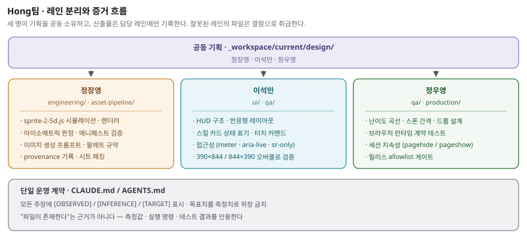

# 1. 팀 구성

3인 팀이며, 세 명 모두 **기획에 공동 참여**한 뒤 구현·UI·QA로 담당을
분리했습니다.

| 이름 | 담당 역할 |
|---|---|
| **정장영** | 기획 · 게임 구현 · 리소스 제작 |
| **이석민** | 기획 · UI · QA |
| **정우영** | 기획 · QA |

---

# 2. 팀원별 담당 영역

## 2.1 정장영 — 기획 / 게임 구현 / 리소스 제작

**기획**

- 게임 콘셉트 및 코어 루프 정의: 웨이브 방어 + 등불 기름 자원 배분
- 전투 수치 설계: 사거리 비대칭(워든 160 / 코호트 76)을 실력 표현의 축으로
  설정하고, 여기서 스탠드오프 플레이가 성립하도록 이동속도·쿨다운을 조정
- 스킬 경제 설계: 기름 회복(초당 7 + 처치당 6) 대비 Ember Nova 45 / Lantern
  Ward 30의 소비 비율로 "언제 태울지" 판단을 강제

**게임 구현**

- `sprite-2-5d.js` 전체 — 고정 60 Hz 시뮬레이션, Canvas2D 깊이 정렬 렌더러,
  입력 라우터, WebAudio 절차 합성, localStorage 런 다이제스트
- 아이소메트릭 전투 판정: 세로축 1.42배 가중 거리 및 facing arc 타격 판정
- 스프라이트 매니페스트 검증기(`validateManifest`) — 시트·격자·프레임 사각형
  불일치 시 게임을 시작시키지 않고 오류 상태로 정지
- 렌더 스냅샷 계약(`window.__SPRITE_2_5D_TEST__`) 노출 — QA가 내부 상태를
  건드리지 않고 관측만으로 검증할 수 있게 하는 읽기 전용 인터페이스

**리소스 제작**

- 이미지 생성 프롬프트 설계 및 실행 (god-tibo-imagen, PerfectPixel `ppgen`)
- 팔레트 규약 수립: 매팅 키 컬러 충돌 방지를 위한 마젠타 계열 전면 금지,
  아군/적 식별을 위한 시안 색 분리
- 생성 자산 provenance 기록 — 프롬프트·모델·응답 ID·SHA-256·권리 영수증
- 스프라이트 시트 패킹 및 매니페스트 내보내기 파이프라인 운용

## 2.2 이석민 — 기획 / UI / QA

**기획**

- 온보딩 설계: 튜토리얼 없이 첫 화면에서 목표·조작·상태가 동시에 읽히도록
  정보 구조 정의
- 세계관 텍스트 설계 — 웨이브 진행에 따라 한 줄씩 열리는 Field record 로어
  비트 6종

**UI**

- `index.html` HUD 구조 및 `sprite-2-5d.css` 레이아웃 전반
- Warden status 패널: 등불 무결성 / 등불 기름 이중 게이지, Wave·Score·
  Hostiles·Relics 텔레메트리 그리드
- Lantern rites 스킬 카드: 쿨다운 잔여 시간, 기름 부족 상태, Ready 상태를
  각각 다른 표기로 구분해 "왜 못 쓰는지"를 즉시 드러냄
- 터치 커맨드: 방향 패드와 Strike 버튼 — 모바일에서 키보드 없이 동등 조작
- 접근성: `role="meter"` + `aria-valuenow` 게이지, `aria-live` 상태 알림,
  아이콘 노드 `aria-hidden` + `.sr-only` 라벨 병기,
  `prefers-reduced-motion` 대응

**QA**

- 반응형 검증: 390×844(세로) / 844×390(가로) 양쪽에서 가로 오버플로 0 확인
- 입력 경로 동등성 검증: 키보드 / 포인터 / 터치 / 화면 버튼 4경로가 모두
  동일 게임 입력에 도달하는지 확인

## 2.3 정우영 — 기획 / QA

**기획**

- 난이도 곡선 설계: 웨이브별 증원 규모와 스폰 간격
  (`max(0.28, 0.62 − wave × 0.018)`), 웨이브 간 2.15초 정비 구간
- 드롭 설계: Ember shard(+18 체력) / Oil flask(+35 기름) /
  Relic mote(+250 점수) 3종 순환과 12초 수명 · 78 자력 반경

**QA**

- 브라우저 런타임 계약 테스트 `tests/sprite-2-5d-browser.cjs` 운용 —
  자산 로드, 상태 전이, 깊이 정렬, 게임오버·재시작, 페이지 오류 0
- 세션 지속성 검증: `pagehide` / `pageshow` 왕복 후 애니메이션 루프가
  중복 생성되지 않고 캔버스가 계속 갱신되는지 확인
- 릴리스 게이트: GitHub Pages 아티팩트가 커밋된 런타임 allowlist에서만
  생성되는지 확인
- **스킬 시스템 결함 발견 및 회귀 방지** — 아래 3장 참조

---

# 3. 협업 · 분업 방식

## 3.1 단일 운영 계약

세 명이 각자 다른 도구와 세션에서 작업하되, 저장소 루트의 `CLAUDE.md`
(및 `AGENTS.md`)를 **단일 운영 계약**으로 공유했습니다. 규칙이 문서 한 곳에만
존재하므로 담당자별로 다른 관행이 생기지 않습니다.

## 3.2 레인 분리

작업 산출물은 `_workspace/current/` 아래 담당 레인에 배치합니다.



| 레인 | 소유 | 담는 것 |
|---|---|---|
| `_workspace/current/design/` | 3인 공동 | 기획·수치·서사 결정 |
| `_workspace/current/engineering/` | 정장영 | 구현·자산 파이프라인 |
| `_workspace/current/ui/` | 이석민 | UI 사양 및 근거 |
| `_workspace/current/qa/` | 이석민 · 정우영 | 검증 결과 |
| `_workspace/current/production/` | 정우영 | 태스크 매니페스트 · 게이트 상태 |

**잘못된 레인에 놓인 파일은 사소한 실수가 아니라 결함으로 취급**합니다.
증거의 소유자가 불분명해지면 검증이 무너지기 때문입니다.

## 3.3 증거 규약

모든 주장에 `[OBSERVED]` / `[INFERENCE]` / `[TARGET]`를 표시합니다.
목표치를 측정치처럼 적는 것을 금지하며, "파일이 존재한다"는 사실은 근거로
인정하지 않습니다. 측정값·실행 명령·테스트 결과를 인용해야 합니다.

## 3.4 동시 작업 안전장치

여러 세션이 같은 저장소를 동시에 편집하므로 다음을 강제했습니다.

- 커밋 전후로 `git status --short`를 확인하고, 예상치 못한 변경은 다른
  담당자의 작업으로 간주한다
- 명시적 경로만 스테이징한다. `git add -A` / `git add .` 금지
- 다른 담당자의 변경을 되돌리거나 덮어쓰지 않는다. 충돌 시 중단하고 기록한다
- 푸시 전 upstream을 명시적으로 페치하고 `@{upstream}..HEAD` 범위를 확인한다.
  force-push 금지

## 3.5 실제 협업 사례 — 스킬 시스템 결함

사전 과제 준비 단계에서 QA 담당(정우영)이 자동 플레이 계측 중 이상을
발견했습니다.

| 단계 | 담당 | 내용 |
|---|---|---|
| 발견 | QA | 45초 자동 플레이에서 `Q` 입력 82회에 기름 소모 0. HUD는 두 스킬을 광고 중 |
| 격리 | QA | 키 입력·버튼 클릭 양쪽 무반응 확인. 동시에 피격은 정상(100→93→86)이므로 게임 자체는 정상 |
| 원인 | 구현 | `handleKeyDown`에 `KeyQ`/`KeyE` 분기 부재 + `skillButtons` 클릭 리스너 미바인딩 → `useSkill()`이 호출되지 않는 죽은 코드 |
| 수정 | 구현 | 키보드 분기 및 버튼 바인딩 추가 |
| 확인 | QA | `Q` 기름 100→77·쿨다운 5.9 s, `E` 77→51·쿨다운 8.5 s, 버튼 클릭 100→64. 3경로 복구 |
| 회귀 | QA | `node tests/sprite-2-5d-browser.cjs` → `SPRITE_2_5D_BROWSER_OK` |
| UI 확인 | UI | 쿨다운 표기·비활성 상태가 실제 스킬 상태와 일치하는지 재확인 |

HUD가 광고하는 핵심 시스템 절반이 동작하지 않는 채로 제출될 뻔한 건을,
**측정 기반 QA가 기획·구현·UI 세 담당을 거쳐 폐쇄**한 사례입니다.

---

# 4. 기여 확인 방법

저장소의 커밋 기록으로 담당별 기여를 확인할 수 있습니다.

```bash
git log --oneline --stat            # 전체 변경 이력
git log --format='%an %s' | sort | uniq -c   # 작성자별 커밋
```

- 저장소: <https://github.com/jellyggumi/Abyssal-Lantern>
- 심사 계정 초대 필요 시: `dl_gameai_reviewer@nhn.com`
