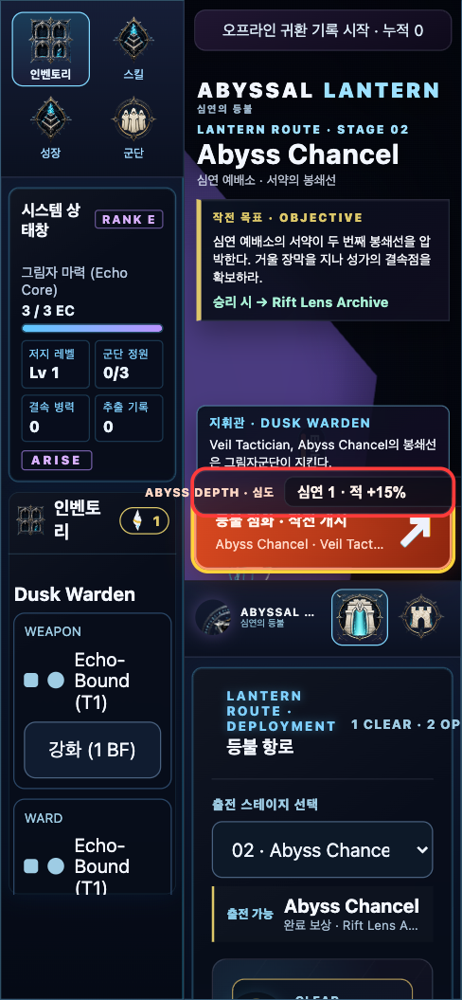
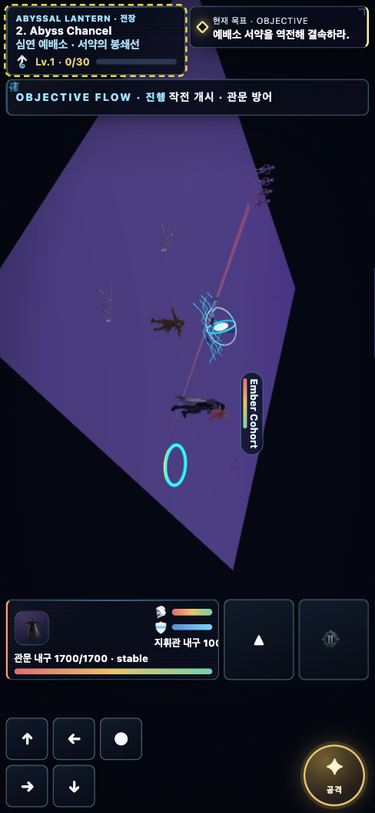

# Onslaught 피벗 이후 — 기존 갭 조사와의 대조 + 추가 조사

> 이 노트가 하는 일: ① 머지로 갱신된 `_workspace`가 무엇인지 확인, ② 지금 게임이 무엇이고 무엇이 바뀌었는지, ③ 앞서 한 디펜스-서바이버 기준 갭 조사(10종)와 대조해 **닫힌 갭/남은 갭**을 가르고, 남은 갭에 대해 **액션 로그라이트 3종(Hades·Dead Cells·Risk of Rain 2)** 을 새로 조사해 추가할 만한 내용을 자연어로 정리.
> 근거: `_workspace/20260728-gameplay-gap-research/`(원 10종 + 액션 3종), `_workspace/current/design/`(피벗 계약), 관련 개념 [[wiki/concepts/onslaught-action-pivot]].

## 한눈에

머지 이후 이 프로젝트는 **게임 정체성과 장르가 통째로 바뀌었다.** 이름은 `Abyssal Command/Surge` → **`Abyssal Lantern`(심연의 등불)**, 장르는 **모바일 디펜스-서바이버(이동만+자동전투) → 액션 핵앤슬래시 로그라이트(직접 베고 대시로 피하는 5–8분 원정)**. 그 결과 내가 앞서 조사한 5대 갭 중 **로그라이트 깊이(G3)는 대거 닫혔고, 아이들(G2)은 아예 무의미(제거)해졌으며, 유한 천장(G1)·리텐션·밸런스는 여전히 열려 있다.** 남은 세 갭은 서바이버/아이들 조사로는 답이 안 나와서, 같은 장르인 **액션 로그라이트 3종을 새로 조사**했고 거기서 **"같은 3스테이지 위에 얹는 clear-to-unlock 난이도 래더"** 라는 하나의 강한 수렴 패턴이 나왔다.

## 1. 업데이트된 workspace — 무엇이 확인됐나

- `_workspace`가 **dated-root 마이그레이션**으로 재편됐다: `current/`(활성 피벗 작업) + `archive/`(과거 런) 구조. 내 이전 연구 런 `20260728-gameplay-gap-research/`는 그대로 보존.
- `_workspace/current/design/`에 **피벗 설계 13+종**이 들어왔다: `master-gdd-delta.md`(변경분 계약), `onslaught-action-product-contract.md`(제품 SSOT), `master-numeric-contract.md`(수치 권위), `action-combat-spec.md`·`manual-combat-controls-spec.md`(수동 전투), `skill-and-growth-spec.md`(20스킬), `boss-pattern-spec.md`, `camera-vfx-direction.md`, `pcg-stage-layout-spec.md`, `encounter-wave-spec.md`, `lobby-story-presentation-spec.md`, `title-concept-rationale.md` 등.
- `production/decision-log.md`에 감독 결정 `D-20260728-OAP-01` = **계획·구현 순서만 승인, 어떤 게이트도 PASS 아님.** 모든 수치는 `[TARGET]`.
- 런타임 쪽엔 `RUNTIME_ANIMATION_CONTRACT.md`, 11개 시맨틱 모션(idle/move/run/hit/bighit/attack/critical/avoid/defence/die/show) + 캐릭터 모션 라이브러리 GLB, `lobby-cinematic.js`, 신규 테스트(ingame-motion-pack, camera-slice-contract, stage-world-encounter-routing-contract 등)가 들어왔다.

## 2. 어떤 게임 + 무엇이 바뀌었나

**지금 게임:** `Abyssal Lantern`(심연의 등불). 마지막 등불을 든 Dusk Warden이 `Cinder Span → Abyss Chancel → Echo Throne` 세 구역을 내려가며 세 보스(`Cinder Warden → Veil Tactician → Gate Sovereign`)를 잡는 **모바일 우선 싱글플레이 Three.js 액션 로그라이트.** 무수익화·오프라인 로컬 저장·60Hz 결정론 시뮬은 유지.

핵심 변경(피벗 델타에서):

| 축 | 이전(디펜스-서바이버) | 이후(액션 로그라이트) |
|---|---|---|
| 조작 | 이동만, 자동 전투 | 이동 + LIGHT_1/2/3 + HEAVY + 무적 DASH(콤보 유지) + 광역 스킬 |
| 한 판 | 약 27초(관전) | 5–8분(직접 전투), 6페이즈(DESCENT→SKIRMISH→SURGE→MIDBOSS→BIGWAVE→FINALE) |
| 스테이지 | 10, authored 고정 | **3, 시드 기반 PCG 셀(3×2)** |
| 실패 | 관문 내구도 0 | 지휘관 사망 — **패배해도 XP 40% + Echo Shard 100% 보존(fail-forward)** |
| 성장 | Echo Core 40, 스킬 플랫 8종 | **Warden Level 1–60 + 스킬 20종/4카테고리/L1–5/티어 해금 + 6칸 로드아웃 + 신규 화폐 Echo Shard(8/스테이지) + 리스펙** |
| 폐기 | — | 자동공격·관문·6단계 목표체인·**3스탠스 포메이션**·인게임 텍스트 컷신 |
| 연출 | 흔들림만 | 카메라 티어·모디파이어 8종·히트스톱·예고 데칼·안개 공정성 하한·VFX 상한 120/70/35 |

한 문장: **"관문을 지키며 자동전투를 관전하던 게임"에서 "직접 베고 피하며 버티는 게임"으로.**

## 3. 내 기존 갭 조사(5갭)와 대조 — 닫힌 것 / 남은 것

앞선 조사는 *디펜스-서바이버 + 아이들* 전제였다. 피벗이 전제를 바꿔서 갭들의 상태가 이렇게 재정렬된다:

- **G3 얕은 로그라이트/포메이션 깊이 → 대체로 닫힘.** 단일 3택8 → 20스킬·4카테고리·L1–5·티어 해금(T1→T2→T3)·6칸 로드아웃, 그리고 수동 전투(콤보 취소·대시)가 agency의 핵심이 됐다. 포메이션은 폐기(손이 이동+3동사+스킬로 이미 참). 내가 제안했던 "콤비 축 추가"를 스킬 티어+수동 전투가 대체.
- **G2 싱크 없는 아이들 → 무의미(제거).** 피벗이 아이들/오프라인 정산을 통째로 걷어냈다(`undertow`는 이제 스테이지 hazard 이름뿐). ⚠️ 코드의 `settleIdleReturn`(`campaign-state.js`)은 **고아 dead code**가 됐다 — 제거하거나 §4의 Daily 시드 배달로 재활용 권장. 단 "아이들 재투자 루프" 교훈은 **Echo Shard 경제**로 이전됨: 설계가 이미 "로드아웃 6칸이 19판에 끝나면 Shard는 파워가 아니라 선택지를 산다"고 명시 → Melvor식 닫힌 루프 정신과 일치.
- **G4 죽은 오소링 콘텐츠 → 부분 정리.** M4 카드·포메이션 스탠스는 decision-log에서 공식 폐기, 정예 추출은 FINALE 보상으로 유지. (아이들이 새로 dead code가 된 건 위 참조.)
- **G1 유한 1회성 천장 → 여전히 열림(부분 완화).** 캠페인은 아직 3스테이지·Echo Throne 종결, **엔드리스/NG+/프레스티지 없음.** Warden Level 1–60 + 패배 이월이 "지속 성장"을 주지만 **그 파워를 쓸 콘텐츠 천장이 없다.**
- **G5 밸런스·성능·휴먼 → 완전 재개(설계상).** 27초 자동전투 근거는 무효. G2/G3/G6/G7/G8 전부 액션 기준 재측정. 성능 목표: 빅웨이브 동시 60체 p95 ≤16.7ms, VFX 상한 120/70/35. 슬라이스 2 뒤 **사람 플레이 판정 게이트**.

**즉, 남은 진짜 갭은 세 개다: (A) 유한 천장, (B) 리텐션/재방문, (C) solved-build 반복 위험.** 이 셋은 서바이버/아이들 조사로는 답이 안 나와서 새로 조사했다.

## 4. 추가할 만한 내용 (액션 로그라이트 3종 신규 조사)

같은 장르인 **Hades · Dead Cells · Risk of Rain 2**를 새로 조사했다. 세 게임 모두 "새 콘텐츠를 만들지 않고 같은 스테이지를 더 어렵게 다시 돌리게 만드는" 장치로 유한 천장을 풀었다 — 이게 우리 GAP-A의 정답 패턴이다.

### GAP-A(유한 천장) — 같은 3스테이지 위에 얹는 clear-to-unlock 난이도 래더 `[제안]`

네 게임이 같은 곳으로 수렴한다: **Hades의 Heat/Pact of Punishment**(첫 클리어 후 스택 가능한 처벌 조건 메뉴, 각 단계 클리어해야 다음), **Dead Cells의 Boss Stem Cells 0–5**(클리어해야 다음 티어 해금, 티어마다 회복 자원을 조인다), **Risk of Rain 2의 Eclipse E1–E8**(각 rung이 고정 핸디캡, 한 번 이겨야 승급), 그리고 내 이전 조사의 **Soulstone Curse 티어**. 공통 규칙은 **"clear N → unlock N+1", 새 맵 0개, 보상은 배수로.**

→ **추가 제안:** Echo Throne 첫 클리어 후 **"Abyss Depth 0–5"**(가칭) 래더를 연다. 각 티어는 `Cinder Span→Abyss Chancel→Echo Throne` 3구역을 **그대로** 재사용하되 적 스케일·보스 페이즈·회복(Echo Shard/힐 픽업)을 단계적으로 조이고 Shard/XP 배수를 준다. 이러면 **Warden Level 1–60의 파워가 비로소 겨눌 콘텐츠**가 생기고, 신규 스테이지 오소링은 0이다. 보상 배수는 이전 PM 밴드 규율(티어당 파워델타 ≤5%p, 스킵 불가 하드 clear-gate)을 그대로 얹는다.

### GAP-B(리텐션/재방문) — 결정론 Daily + 서사 잠금해제 `[제안]`

RoR2의 **Prismatic Trials**(고정 공유 시드 + 리더보드)는 비수익화 재방문 훅의 좋은 모델이지만 **부정행위로 망가진 게 최대 경고**다. 우리는 **60Hz 결정론 + `getRunDigest` 리플레이**가 이미 있어서 이 결함을 구조적으로 고칠 수 있다 → **"Daily Echo"**: 매일 고정 시드 한 판, 결과를 입력테이프 리플레이로 검증하는 **로컬/친구 리더보드**(치팅 불가). 여기에 **Hades식 서사 견인**을 더한다: 로비 `기록` 탭(비디오 6/인엔진 10/스틸 14, 이미 설계됨)의 비트를 **재방문·티어 클리어 보상으로 잠금해제** → FOMO 없는, 무수익화 pull. (고아가 된 `settleIdleReturn`을 Daily 시드 배달 경로로 재활용할 수 있다.)

### GAP-C(solved-build 반복 위험) — 감쇠 스택 + 카테고리 소프트캡 + 티어별 적 정책 로테이션 `[제안]`

20스킬·티어·6칸이 강해질수록 "하나의 지배 빌드가 전 판을 시시하게 만드는" 위험이 커진다(이전 조사에서 VS·20MTD·HoloCure 공통 최다 불만). **RoR2가 반면교사**다 — 곱셈식 아이템 스택 + 숨은 proc 체인이 "삭제 아니면 삭제당함" 런어웨이를 만들고 소프트캡이 없다. **Hades는 반대로** Boon 조합/듀오/레전더리 다양성으로 단일 해답을 막는다.

→ **추가 제안:** (1) 스킬 스택은 **곱셈이 아니라 쌍곡/감쇠**로, **카테고리별 소프트캡**을 둔다. (2) 6칸 로드아웃과 리스펙 수수료를 **기회비용**으로 활용해 "다 담기" 불가. (3) **Abyss Depth 티어마다 지배 적 정책을 교체**한다(우리 4역할 `rusher/flanker/guardian/ranged`의 비중을 티어별로 로테이션) → 적 *수학*이 바뀌므로 단일 빌드가 전 티어를 못 푼다. 이건 GAP-A 래더와 자연히 결합한다.

## 5. 교차 회피 (불만 데이터)

- **곱셈 런어웨이 + 리더보드 치팅**(RoR2) → 감쇠 스택 + 결정론 리플레이 검증으로 회피.
- **수익화 천장**(Kingshot·Legend of Mushroom·Survivor.io 최다 불만) → 우리 무수익화 = 공짜 승점. 천장은 "지출"이 아니라 **숙련·시간**으로 페이싱.
- **후반 성능 붕괴**(Soulstone #1 불만) → 우리 G6 이미 재측정 대상. 빅웨이브 60체 p95 ≤16.7ms + VFX 상한을 **엔드리스/티어 래더 착수 전** 게이트로.
- **아이템풀 희석**(Brotato) → 스킬 20종·티어 해금이 이미 풀을 좁혀 유지 중.
- **진행 무효화 리셋**(AFK Journey 시즌리셋 반발) → 래더는 **누적 위에 얹는 선택적 난이도**여야지 성장 초기화가 아니어야 함.

## 6. 정리 및 다음 액션

1. **고아 코드 정리:** `campaign-state.js`의 `settleIdleReturn`/아이들 잔재를 제거하거나 Daily Echo 시드 배달로 재활용.
2. **GAP-A가 최우선 추가 후보:** clear-to-unlock "Abyss Depth" 래더 — 4게임 수렴, 신규 콘텐츠 0, Warden 1–60에 목표를 줌. 단 G6 성능 게이트 뒤.
3. **GAP-B:** 결정론 Daily Echo + 서사 잠금해제(로비 기록 탭 재활용).
4. **GAP-C:** 감쇠 스택 + 카테고리 소프트캡 + 티어별 적 정책 로테이션 — GAP-A 래더와 결합.
5. 전부 `[TARGET]` 제안이며, 피벗 계약대로 **슬라이스 2 사람 플레이 판정 통과 전에는 어떤 것도 확정 아님.**

## 실동작 캡처 — Abyss Depth (구현됨, 커밋 fc8599cb)

오늘 제안 중 GAP-A/C를 현재 빌드에 구현한 **Abyss Depth 난이도 래더**의 Playwright 캡처. 전체 설명: [[wiki/reports/demo/CHANGES-WALKTHROUGH]]. 원본도 `_workspace/20260728-gameplay-gap-research/demo/`.

**[1/3] 전투개시에 신규 심도 셀렉터(잠금 티어) — 현 세이브에서 바로 보임**

**[2/3] Cinder Span 1클리어 → 심연 1 해금·선택 (`· 심연 1` 라벨)**

**[3/3] 심도 1 전투 진입 → HUD `ABYSS DEPTH 1` 배지, 적 +15% + 정책 로테이션**

실측: depth 0 = 기존 다이제스트 바이트 동일(유닛 76/76·CI 3/3), depth 1/3 = 적 HP 3000→4140→5220. 런-스코프(저장 무변경).

## Sources

액션 로그라이트 신규 조사(각 JSON은 `_workspace/20260728-gameplay-gap-research/research/action-roguelite-supplement/`):
- Hades — https://en.wikipedia.org/wiki/Hades_(video_game) (Heat/Pact of Punishment)
- Dead Cells — https://en.wikipedia.org/wiki/Dead_Cells (Boss Stem Cells 0–5)
- Risk of Rain 2 — https://store.steampowered.com/app/632360/Risk_of_Rain_2/ (Eclipse E1–E8, Prismatic Trials)

원 10종 조사(서바이버/아이들): `_workspace/20260728-gameplay-gap-research/research/comparable-gameplay/report.md` — Soulstone Survivors(Curse), Survivor.io(3일 챌린지), Melvor Idle(닫힌 재투자 루프) 등.

## Cross-references

- [[wiki/concepts/onslaught-action-pivot]] — 피벗 개념(장르 델타·게이트 상태)
- [[wiki/entities/abyssal-surge]] — 게임 엔티티(현 배포 빌드 기준, Abyssal Lantern으로 리네임됨)
- `_workspace/current/design/master-gdd-delta.md` — 변경분 계약(권위)
- `_workspace/current/design/onslaught-action-product-contract.md` — 제품 SSOT
- `_workspace/20260728-gameplay-gap-research/production/gap-analysis.md` — 이전 5갭 분석(디펜스-서바이버 기준)
- `_workspace/20260728-gameplay-gap-research/production/meeting-record.md` — 이전 회의 판정
